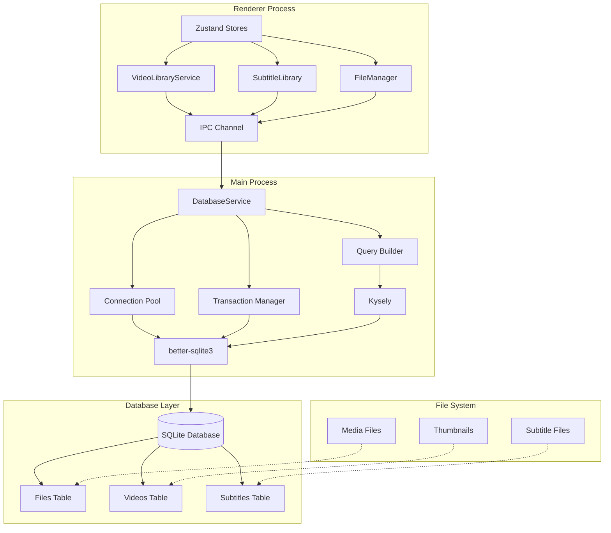

# Design Document - Support SQLite

## Overview

本设计文档描述了为EchoPlayer引入基于better-sqlite3和Kysely的SQLite持久化层的架构实现方案。该功能旨在替换当前的Dexie/IndexedDB方案，为用户播放记录、字幕数据和学习进度提供更强大、更可靠的数据存储解决方案。

SQLite作为本地数据库标准，将提供ACID事务特性、复杂SQL查询支持、外键约束和优异的性能表现。结合Kysely的类型安全查询构建器，该实现将为EchoPlayer的数据层提供企业级的可靠性和开发体验。

## Steering Document Alignment

### Technical Standards (tech.md)

本设计遵循项目的TypeScript First、性能优先和类型安全的技术理念：

- **TypeScript Integration**: 利用Kysely的完整TypeScript支持，提供编译时类型检查和IDE智能提示
- **Performance Focus**: SQLite的本地性能优势，查询响应时间目标<50ms，复杂分析查询<200ms
- **Electron Architecture**: 遵循主进程/渲染进程分离的安全架构模式
- **Error Handling**: 统一的错误处理机制，提供详细的错误上下文和恢复策略

### Project Structure (structure.md)

实现将严格遵循现有项目结构约定：

- **Service Layer**: 扩展现有的`src/main/services/`架构，添加数据库相关服务
- **Type System**: 利用现有的`src/renderer/src/infrastructure/types/`类型定义体系
- **IPC Communication**: 遵循现有的IPC通信模式和错误处理约定
- **Logging Integration**: 使用现有的loggerService进行统一日志管理

## Code Reuse Analysis

### Existing Components to Leverage

- **LoggerService**: 复用现有的结构化日志系统，为数据库操作提供详细的性能监控和错误追踪
- **FileStorage Service**: 集成文件元数据管理，将SQLite作为文件索引和关联数据的存储后端
- **IPC Infrastructure**: 利用现有的主进程-渲染进程通信架构，确保数据库操作的安全隔离
- **Type Definitions**: 扩展现有的FileMetadata、VideoLibraryRecord、SubtitleLibraryRecord类型定义

### Integration Points

- **VideoLibraryService**: 无缝迁移现有API，保持向后兼容性的同时增强查询能力
- **SubtitleLibrary**: 集成字幕文件管理和元数据索引，支持全文搜索和关联分析
- **State Management**: 与现有Zustand stores集成，提供响应式数据更新和缓存同步

## Architecture

EchoPlayer SQLite集成采用主进程集中式数据库管理架构，通过IPC提供类型安全的数据访问接口：



## Components and Interfaces

### DatabaseService (Main Process)

- **Purpose**: 核心数据库管理服务，负责连接、事务和查询协调
- **Interfaces**: 
  - `initializeDatabase()`: 数据库初始化和schema迁移
  - `executeQuery<T>(query: string, params: any[]): Promise<T>`
  - `executeTransaction<T>(operations: TransactionOperation[]): Promise<T>`
  - `getConnectionHealth(): DatabaseHealth`
- **Dependencies**: better-sqlite3, Kysely, LoggerService
- **Reuses**: 现有的错误处理模式和日志记录基础设施

### SQLiteVideoLibraryService

- **Purpose**: 替换现有VideoLibraryService，提供增强的查询和分析能力
- **Interfaces**:
  - `addOrUpdateRecord(record: VideoRecord): Promise<VideoRecord>`
  - `findRecordsWithComplexQuery(query: VideoQueryBuilder): Promise<VideoRecord[]>`
  - `getAnalytics(timeRange: DateRange): Promise<PlaybackAnalytics>`
  - `searchByContent(searchTerms: string[]): Promise<VideoRecord[]>`
- **Dependencies**: DatabaseService, 现有的VideoLibraryRecord类型
- **Reuses**: 保持现有API签名兼容性，扩展内部实现

### SQLiteSubtitleService

- **Purpose**: 字幕文件索引和搜索，支持全文检索和内容查询
- **Interfaces**:
  - `indexSubtitleContent(subtitleId: string, content: SubtitleEntry[]): Promise<void>`
  - `searchSubtitleText(query: string, languages?: string[]): Promise<SubtitleSearchResult[]>`
  - `getSubtitleStatistics(videoId: string): Promise<SubtitleStats>`
- **Dependencies**: DatabaseService, SubtitleReader服务
- **Reuses**: 现有的字幕解析逻辑和文件处理工具

### TypeSafeQueryBuilder

- **Purpose**: 基于Kysely的类型安全查询构建器，提供编译时验证
- **Interfaces**:
  - `selectFrom<T>(table: keyof DatabaseSchema): SelectQueryBuilder<T>`
  - `insertInto<T>(table: keyof DatabaseSchema): InsertQueryBuilder<T>`
  - `updateTable<T>(table: keyof DatabaseSchema): UpdateQueryBuilder<T>`
- **Dependencies**: Kysely, 数据库Schema类型定义
- **Reuses**: TypeScript类型系统和现有的类型定义约定

### IPC Data Access Layer

- **Purpose**: 安全的跨进程数据访问封装，提供统一的错误处理
- **Interfaces**:
  - `invoke<T>(channel: string, ...args: any[]): Promise<T>`
  - `registerHandler(channel: string, handler: IPCHandler): void`
  - `createTypedChannel<T>(schema: T): TypedIPCChannel<T>`
- **Dependencies**: Electron IPC, 现有的通信基础设施
- **Reuses**: 现有的IPC错误处理和序列化逻辑

## Data Models

### Enhanced Files Table

```sql
CREATE TABLE files (
  id TEXT PRIMARY KEY,
  name TEXT NOT NULL,
  origin_name TEXT NOT NULL,
  path TEXT NOT NULL UNIQUE,
  size INTEGER NOT NULL,
  ext TEXT NOT NULL,
  type TEXT NOT NULL CHECK (type IN ('video', 'audio', 'subtitle', 'other')),
  created_at TEXT NOT NULL,
  updated_at TEXT NOT NULL DEFAULT CURRENT_TIMESTAMP,
  hash TEXT UNIQUE, -- MD5 hash for duplicate detection
  INDEX idx_files_type (type),
  INDEX idx_files_ext (ext),
  INDEX idx_files_hash (hash)
);
```

### Enhanced Video Library Table

```sql
CREATE TABLE video_library (
  id INTEGER PRIMARY KEY AUTOINCREMENT,
  file_id TEXT NOT NULL,
  current_time REAL NOT NULL DEFAULT 0,
  duration REAL NOT NULL DEFAULT 0,
  played_at INTEGER NOT NULL,
  first_played_at INTEGER NOT NULL,
  play_count INTEGER NOT NULL DEFAULT 1,
  is_finished BOOLEAN NOT NULL DEFAULT FALSE,
  is_favorite BOOLEAN NOT NULL DEFAULT FALSE,
  thumbnail_path TEXT,
  completion_percentage REAL GENERATED ALWAYS AS (
    CASE WHEN duration > 0 THEN (current_time * 100.0 / duration) ELSE 0 END
  ) STORED,
  FOREIGN KEY (file_id) REFERENCES files (id) ON DELETE CASCADE,
  UNIQUE (file_id),
  INDEX idx_video_library_played_at (played_at DESC),
  INDEX idx_video_library_play_count (play_count DESC),
  INDEX idx_video_library_favorite (is_favorite),
  INDEX idx_video_library_completion (completion_percentage)
);
```

### Enhanced Subtitle Library Table

```sql
CREATE TABLE subtitle_library (
  id INTEGER PRIMARY KEY AUTOINCREMENT,
  video_id INTEGER NOT NULL,
  file_path TEXT NOT NULL,
  language TEXT,
  encoding TEXT DEFAULT 'utf-8',
  content_hash TEXT,
  entry_count INTEGER DEFAULT 0,
  created_at TEXT NOT NULL DEFAULT CURRENT_TIMESTAMP,
  indexed_at TEXT, -- Full-text indexing timestamp
  FOREIGN KEY (video_id) REFERENCES video_library (id) ON DELETE CASCADE,
  UNIQUE (video_id, file_path),
  INDEX idx_subtitle_library_video (video_id),
  INDEX idx_subtitle_library_language (language)
);
```


## Error Handling

### Database Connection Errors

1. **Connection Failed**:
   - **Handling**: 实现指数退避重连机制，最多重试5次
   - **User Impact**: 显示"数据库连接异常，正在重试"提示，保持应用基本功能可用

2. **Database Corrupted**:
   - **Handling**: 自动备份当前数据库，尝试修复或重新初始化
   - **User Impact**: 提示用户数据恢复过程，可能丢失最近的更改

### Transaction Failures

1. **Constraint Violation**:
   - **Handling**: 回滚事务，记录详细错误信息，提供数据修复建议
   - **User Impact**: 显示具体的数据验证错误，指导用户修正输入

2. **Deadlock Detection**:
   - **Handling**: 自动重试事务，使用随机延迟避免重复死锁
   - **User Impact**: 透明处理，用户感知延迟但操作最终成功

### Migration Errors

1. **Schema Version Mismatch**:
   - **Handling**: 自动检测版本差异，执行渐进式迁移
   - **User Impact**: 显示数据库升级进度，禁止用户操作直到完成

2. **Data Loss Risk**:
   - **Handling**: 强制备份现有数据，提供迁移预览和确认机制
   - **User Impact**: 用户明确确认后才执行可能导致数据丢失的操作

## Testing Strategy

### Unit Testing

- **Database Service**: 使用内存SQLite数据库进行isolated测试，验证CRUD操作、事务处理和错误恢复
- **Query Builder**: 测试Kysely查询构建的正确性，验证生成的SQL语句和类型安全性
- **Service Layer**: 模拟数据库依赖，专注于业务逻辑和API契约的正确性
- **Migration Scripts**: 测试数据库版本升级路径，确保向前和向后兼容性

### Integration Testing

- **IPC Communication**: 验证主进程和渲染进程之间的数据传输完整性和性能
- **File System Integration**: 测试文件元数据与数据库记录的同步机制
- **Concurrent Operations**: 验证多用户并发访问和事务隔离的正确性
- **Performance Benchmarks**: 建立查询性能基线，监控回归问题

### End-to-End Testing

- **User Workflows**: 模拟完整的视频播放、字幕管理和学习记录工作流
- **Data Migration**: 从Dexie到SQLite的完整迁移流程测试
- **Error Recovery**: 模拟各种异常情况，验证系统的健壮性和恢复能力
- **Cross-Platform**: 验证Windows、macOS、Linux平台的一致性表现

### Performance Testing

- **Query Performance**: 确保查询响应时间满足<50ms（常规）和<200ms（复杂分析）的目标
- **Memory Usage**: 监控数据库连接池和缓存的内存占用
- **Concurrent Load**: 测试高并发场景下的性能表现和资源利用效率
- **Large Dataset**: 验证大量数据场景下的查询性能和存储效率

## Migration Strategy

### Phase 1: Foundation Setup
- 建立SQLite数据库基础设施
- 实现核心DatabaseService和连接管理
- 创建基础数据表和索引结构

### Phase 2: Service Migration  
- 逐步迁移VideoLibraryService到SQLite实现
- 保持API兼容性，内部切换存储后端
- 实现数据迁移工具从Dexie导入历史数据

### Phase 3: Enhanced Features
- 实现高级查询和分析功能
- 添加全文搜索和复杂关联查询
- 实现字幕内容索引和全文搜索功能

### Phase 4: Performance Optimization
- 查询性能优化和索引调优
- 连接池配置和缓存策略优化
- 监控和告警体系建立