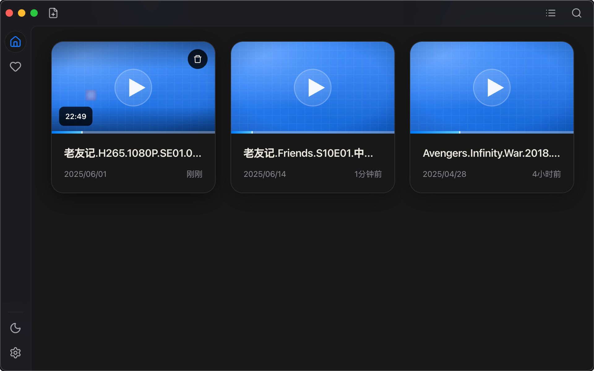
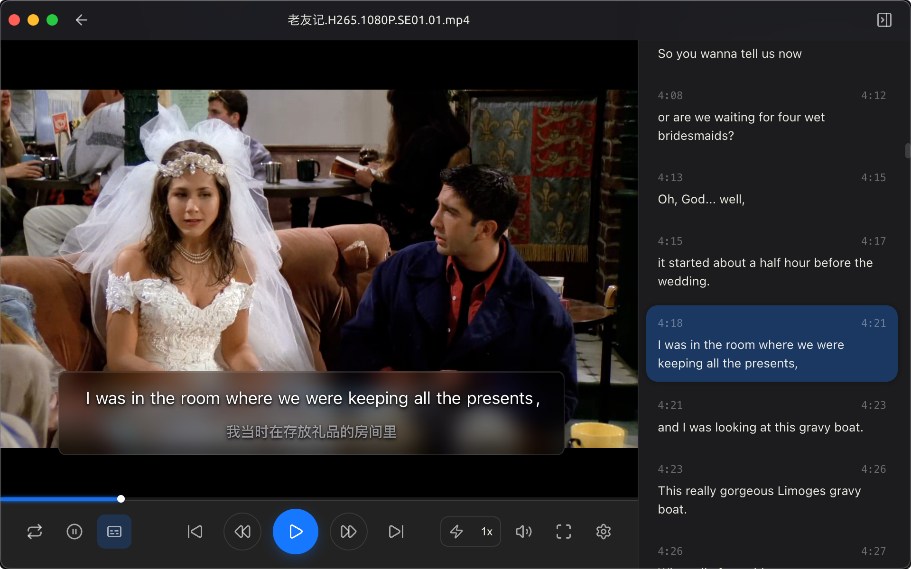

# EchoPlayer

<div align="center">

**专为语言学习者设计的视频播放器**

[](LICENSE)
[](https://electronjs.org)
[](https://reactjs.org)
[](https://typescriptlang.org)
<br/>

[](https://github.com/mkdir700/EchoPlayer/releases)

[安装](#-安装) • [使用指南](#-使用指南) • [功能特性](#-功能特性) • [开发](#-开发)

</div>

---

## 📖 项目简介

EchoPlayer 是一款专为语言学习者设计的视频播放器，通过**逐句精听**的方式帮助用户高效学习外语。无论是电影、电视剧、纪录片还是教学视频，EchoPlayer 都能让您的视频学习体验更加专业和高效。

> **⚠️ 开发状态说明**
> 本软件目前处于**早期开发阶段**，功能和界面可能会有所调整。我们正在积极开发和优化中，欢迎您的反馈和建议！

## 📱 软件截图

### 首页界面



### 播放页面



## ✨ 功能特性

### 🎯 核心功能

- **逐句播放控制** - 一键跳转到上一句/下一句字幕
- **自动暂停/恢复** - 每句字幕结束后自动暂停，便于消化理解。延迟自定义时间后恢复播放
- **单句循环** - 重复播放当前字幕句子，强化练习
- **多语言字幕** - 同时显示原文和译文，支持双语学习

## 🚀 安装

### 系统要求

- **Windows**: Windows 10/11 (64位)
- **macOS**: macOS 10.15+ (支持 Intel 和 Apple Silicon)
- **Linux**: Ubuntu 18.04+ 或其他主流发行版

### 下载安装

1. 前往 [Releases](../../releases) 页面
2. 下载适合您系统的安装包
3. 运行安装程序完成安装

### 格式支持

- **视频格式**: MP4、AVI、MKV、MOV、WMV、FLV
- **字幕格式**: SRT、VTT、ASS/SSA、JSON

## 📖 使用指南

### 快速开始

1. **添加视频**: 点击"添加视频"按钮选择本地视频文件
2. **导入字幕**: 应用会自动检测同名字幕文件，或手动选择
3. **开始学习**: 使用播放控制按钮进行逐句精听练习

### 字幕操作

- **自动检测**: 放置同名字幕文件在视频目录，自动导入
- **手动导入**: 点击字幕按钮手动选择字幕文件
- **显示模式**: 支持原文、译文、双语三种显示模式

## 🛠 技术栈

### 核心技术

- **Electron** - 跨平台桌面应用框架
- **React** - 现代化前端框架
- **TypeScript** - 类型安全的开发体验
- **Ant Design** - 专业的 UI 组件库

## 💻 开发

### 环境要求

- **Node.js** 18.0+
- **pnpm** 8.0+

### 本地开发

```bash
# 克隆项目
git clone https://github.com/your-username/echoplayer.git
cd echoplayer

# 安装依赖
pnpm install

# 启动开发服务器
pnpm dev
```

### 构建发布

```bash
# 构建应用
pnpm build

# 打包 Windows 版本
pnpm build:win

# 打包 macOS 版本
pnpm build:mac

# 打包 Linux 版本
pnpm build:linux
```

### 测试

```bash
# 运行测试
pnpm test

# 运行测试并生成覆盖率报告
pnpm test:coverage

# 交互式测试界面
pnpm test:ui
```

## 🤝 贡献指南

我们欢迎任何形式的贡献！

1. Fork 本项目
2. 创建特性分支 (`git checkout -b feature/AmazingFeature`)
3. 提交更改 (`git commit -m 'Add some AmazingFeature'`)
4. 推送到分支 (`git push origin feature/AmazingFeature`)
5. 打开 Pull Request

## 📝 更新日志

查看 [CHANGELOG.md](CHANGELOG.md) 了解详细的版本更新记录。

## 📄 许可证

本项目基于 [Apache License 2.0](LICENSE) 开源许可证发布。

## 🙏 致谢

- [Cherry Studio](https://github.com/CherryHQ/cherry-studio) - 一款为创造而生的 AI 助手

---

<div align="center">

**如果这个项目对您有帮助，请给我们一个 ⭐️**

[问题反馈](../../issues) • [功能建议](../../discussions) • [联系我们](mailto:mkdir700@gmail.com)

</div>
