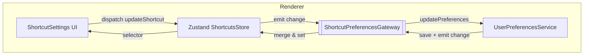

# Shortcut Preferences Integration Design
**版本：v1.0 – 2025-07-13**

> 方案 B：以 **UserPreferencesService (UPS)** 作为 _唯一_ 偏好中心，
> **ShortcutsStore (ZSS)** 仅做 UI 层缓存。本文描述实现细节、同步协议与迁移步骤。

---

## 1. 设计目标
1. **统一存储**：所有用户偏好（主题、播放、布局、快捷键等）由 UPS 持久化，保持单一事实来源 (SSoT)。
2. **即时交互**：渲染端仍通过 ZSS 获得毫秒级状态响应。
3. **强一致性**：ZSS 与 UPS 之间的双向同步确保任何来源的变动都能在两侧反映。
4. **版本迁移**：沿用 UPS 现有迁移框架，对 `shortcuts` 字段纳入版本控制。
5. **可测试 & 可维护**：最小化耦合并提供清晰接口，方便单元 / E2E 覆盖。

---

## 2. 总体架构



### 关键组件
| 组件 | 职责 |
| --- | --- |
| **UPS** | 1. 持久化所有偏好 <br/>2. 版本迁移、备份、导入导出 <br/>3. 通过事件系统广播偏好变更 |
| **ZSS** | 1. React Hook 即时读写 <br/>2. 本地 Immer 数据结构 <br/>3. 订阅 UPS 更新 |
| **Gateway** | 1. 监听 ZSS 更新并调用 `UPS.updatePreferences` <br/>2. 监听 UPS 事件并 merge 至 ZSS <br/>3. 去抖、冲突解决 |

---

## 3. 同步协议

### 3.1 内部调用：ZSS → UPS

| 场景 | 方法 | 负载示例 |
| ---- | -------- | -------- |
| 用户修改快捷键 | `UPS.updatePreferences` | `{ shortcuts: { playPause: ['Space'] } }` |

*Gateway* 负责抽样变化并调用一次合并，而非每击键同步，节流建议：`300ms debounce`。

### 3.2 事件广播：UPS → ZSS

UPS 在以下时机通过 `preferences:changed` 事件（基于 mitt / EventEmitter）广播最新偏好：
1. 任意 `savePreferences` 成功后。
2. 外部导入 / 复位至默认。
3. 版本迁移完成。

负载：完整 `UserPreferences` 对象或仅 diff，推荐 **完整对象** 简化合并逻辑。

---

## 4. 数据结构变更

```ts
// @types_/domain.ts
export interface ShortcutMap {
  [key: string]: string | string[];
}

export interface UserPreferences {
  ...
  shortcuts: ShortcutMap; // 从 string -> string[] 统一
}
```

ZSS 现有 `Shortcut[]` 需在 Gateway merge 时做 **数组 ↔︎ 对象** 转换。

---

## 5. 迁移步骤

1. **Schema 扩展**
   - 在 `UserPreferencesService.getDefaultPreferences()` 中保持 `shortcuts` 字段，格式升级为数组。
2. **版本号提升** `2.0.0 -> 2.1.0` 并添加 `migrateShortcuts()`：
   - 若检测旧版本 `string` 格式或缺失字段 → 转换为数组形式。
3. **实现 Gateway**
   - `useEffect`：初始化时 `UPS.getPreferences()` 并 `ZSS.setShortcuts(...)`
   - 订阅 `preferences:changed` 更新 ZSS。
   - 监听 ZSS `subscribe`，比较前后值变化并合并调用 `UPS.updatePreferences`.
4. **删除 ZSS 持久化中间件**
   - Store 不再自行持久化，仍可保留 sessionStorage 级缓存 (optional)。
5. **测试**
   - 单元：Gateway diff 计算、去抖、冲突策略。
   - E2E：修改快捷键 → 重启 → 读取 UPS → UI 展示一致。

---

## 6. 冲突解决策略

1. **时间戳优先**：UPS 保存 `lastUpdated`；Gateway 比较远端与本地时间戳。
2. **单窗口场景**：渲染进程单实例可忽略并发；多窗口需额外“窗口优先级”或乐观锁。

---

## 7. 错误处理

- UPS 保存失败：Gateway 回滚 ZSS 修改并 Toast 提示。
- 同步超时：重试 3 次后进入离线模式，仅本地缓存，待下次启动同步。

---

## 8. 开发里程碑

| 日期 | 事项 |
| ---- | ---- |
| T+0 | 完成类型定义 & UPS 迁移函数 |
| T+2 | 实现 Gateway（Renderer） + IPC handler（Main）|
| T+4 | 修改 ZSS 去除持久化中间件 |
| T+6 | 单元 & 集成测试通过 |
| T+7 | 更新文档 / 发布版本 2.1.0 |

---

## 9. 风险与缓解

| 风险 | 缓解 |
| ---- | ---- |
| 双向同步循环写入 | Gateway 比较对象引用 + 去抖 |
| 多窗口并发 | 加入 `sourceWindowId` 字段避免回显 |
| 性能 | IPC 批量合并+去抖，避免高频写磁盘 |

---

## 10. 结论

通过将 **快捷键** 并入 **UPS**，我们实现了完整的用户偏好统一持久化，并保留 ZSS 的即时响应体验。Gateway 作为薄同步层，代码可测试且易扩展，为未来云同步奠定基础。
