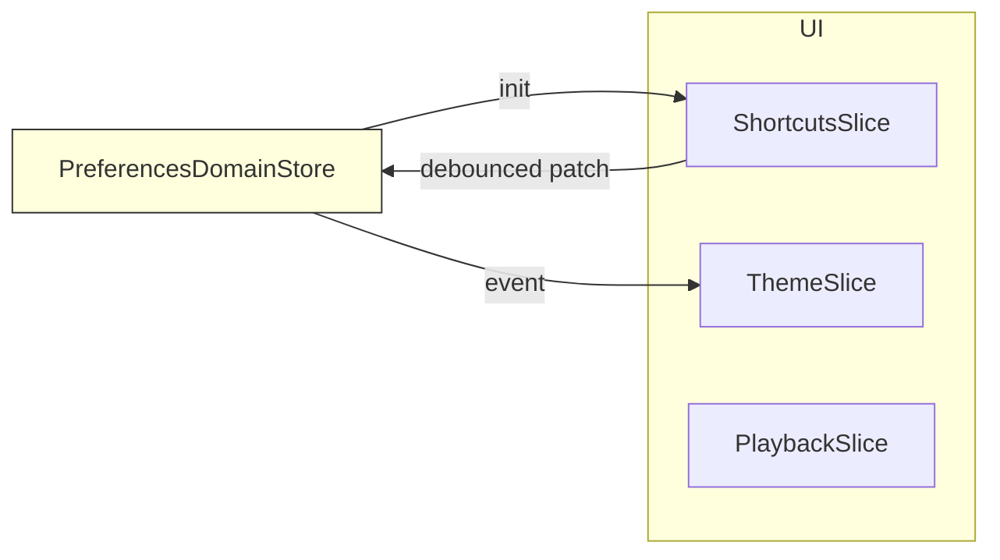

# 方案 C ：Domain Store + UI Slice 重构方案
**版本 v1.0 – 2025-07-13**

---

## 0. 目标概述
| 目标 | 说明 |
| --- | --- |
| **单一事实来源** | `PreferencesDomainStore` 作为整个应用唯一的偏好持久化层。 |
| **细粒度 UI 性能** | 界面组件通过各自的 *Slice Store*（Zustand slice）消费所需局部状态，最小化渲染。 |
| **低耦合** | Domain Store ≠ UI Slice，只通过订阅 / 发布桥接，存储介质可随时替换。 |
| **易测试** | Slice Store 可通过 mock Domain Store 独立测试；Domain Store 单独做序列化、迁移测试。 |
| **云同步准备** | Domain Store 暴露 `export()` / `import()`，便于远端同步。 |

---

## 1. 关键概念

| 名称 | 位置 | 职责 |
| --- | --- | --- |
| **PreferencesDomainStore (PDS)** | `src/renderer/src/v2/state/domain/preferences.domain.ts` | 1) 使用 `zustand` + `persist` 中间件<br>2) 落盘到 `@electron/remote` 的 `electron-store` 或 `JSON file`<br>3) 暴露 `getState / setState / subscribe` |
| **Slice Store** | `useShortcutsSlice.ts` `useThemeSlice.ts` … | 1) 仅保存 UI 需要的局部字段<br>2) 在初始化从 PDS 拉取<br>3) 监听自身字段变化 → 写回 PDS（节流） |
| **SyncAdapter** | `src/renderer/src/v2/state/adapters/preferencesSync.adapter.ts` | 针对每个 Slice 提供 `bindSlice(pdsSelector, sliceSet)` 帮助函数，封装订阅逻辑 |



---

## 2. 目录结构

```
src/renderer/src/v2/state/
  domain/
    preferences.domain.ts
  slices/
    shortcuts.slice.ts
    theme.slice.ts
    ...
  adapters/
    preferencesSync.adapter.ts
```

---

## 3. PreferencesDomainStore 实现

```typescript
// preferences.domain.ts
import create from 'zustand'
import { immer } from 'zustand/middleware/immer'
import { persist } from 'zustand/middleware'
import { defaultPreferences } from './defaults'

export const usePreferencesDomainStore = create(
  persist(
    immer((set, get) => ({
      ...defaultPreferences,
      setPartial: (patch: Partial<UserPreferences>) =>
        set((state) => Object.assign(state, patch))
    })),
    {
      name: 'user-preferences',          // storage key
      version: 2,                       // bump 时走 migrate
      migrate: (persisted, version) => migratePreferences(persisted, version),
      storage: electronStoreStorage()   // 自定义 electron-store adapter
    }
  )
)
```

---

## 4. Slice Store 模板

```typescript
// shortcuts.slice.ts
import create from 'zustand'
import { immer } from 'zustand/middleware/immer'
import { usePreferencesDomainStore } from '../domain/preferences.domain'
import { bindSlice } from '../adapters/preferencesSync.adapter'

interface ShortcutsSliceState {
  shortcuts: Shortcut[]
  updateShortcut: (key: string, patch: Partial<Shortcut>) => void
}

export const useShortcutsSlice = create<ShortcutsSliceState>()(
  immer((set, get) => {
    /* 1️⃣ 初始同步 */
    const domain = usePreferencesDomainStore.getState()
    set({ shortcuts: fromObject(domain.shortcuts) })

    /* 2️⃣ 定义本地修改方法 */
    const updateShortcut = (key: string, patch: Partial<Shortcut>) => {
      set((state) => {
        const target = state.shortcuts.find((s) => s.key === key)
        if (target) Object.assign(target, patch)
      })
    }

    return { shortcuts: [], updateShortcut }
  })
)

/* 3️⃣ 双向绑定（节流 300 ms） */
bindSlice({
  slice: useShortcutsSlice,
  selector: (s) => toObject(s.shortcuts),
  patchToDomain: (patch) => ({ shortcuts: patch }),
  debounceMs: 300
})
```

---

## 5. SyncAdapter 关键实现

```typescript
// preferencesSync.adapter.ts
import debounce from 'lodash/debounce'

interface BindOptions<SliceState, DomainPatch> {
  slice: ZustandStore<SliceState>
  selector: (state: SliceState) => DomainPatch   // 提取需要写回 Domain 的部分
  patchToDomain: (p: DomainPatch) => Partial<UserPreferences>
  debounceMs?: number
}

export function bindSlice(opts: BindOptions<any, any>) {
  const { slice, selector, patchToDomain, debounceMs = 0 } = opts
  const pds = usePreferencesDomainStore

  /* 订阅 Slice -> Domain */
  const push = debounce((patch) => pds.getState().setPartial(patchToDomain(patch)), debounceMs)
  slice.subscribe(selector, push, { fireImmediately: false })

  /* 订阅 Domain -> Slice（同字段 diff）*/
  pds.subscribe(
    (state) => selector(slice.getState()),          // 当前 UI 值
    (current, prev) => {
      if (current !== prev) slice.setState({ ...slice.getState(), ...current }, true)
    }
  )
}
```

---

## 6. 数据流时序

| 时机 | 步骤 |
| ---- | ---- |
| **启动** | 1) PDS 从磁盘 hydrate → `stateReady`<br>2) 各 Slice `init` 读取当前 PDS 值 |
| **用户修改** | 1) Component 调用 `useShortcutsSlice.updateShortcut`<br>2) Slice 状态更新→React 立即渲染<br>3) Adapter 节流后将 patch 写回 PDS<br>4) PDS `persist` 中间件自动落盘 |
| **外部导入** | 1) 调用 `PDS.setState(importedPrefs)`<br>2) PDS 触发 subscribe → 各 Slice 自动 merge |

---

## 7. 迁移步骤

1. **创建 PDS 与默认值文件** (`defaults.ts`)
2. **对现有 `ShortcutsStore`**：
   - 重命名为 `shortcuts.slice.ts`，删除 `persist` 中间件。
   - 字段保持 `Shortcut[]`；增加 `updateShortcut`。
3. **实现 SyncAdapter**，先绑定 Shortcuts Slice；后续再绑定主题、播放等 Slice。
4. **删除老的 `shortcuts-store` 本地存储条目**（在 migrate 钩子清理）。
5. **测试**：
   - Unit: Slice → PDS 写回；PDS 写 Slice。
   - E2E: 修改快捷键 → 重启 → 值保持。
6. **文档**：更新开发手册 & 用户数据迁移说明。

---

## 8. 风险与对策

| 风险 | 对策 |
| --- | --- |
| Slice 与 PDS 循环写入 | `subscribe(selector)` + 引用比较；Adapter 内部 `debounce` |
| 首屏加载延迟 | Domain Store hydrate 完成后再渲染设置页（或 skeleton） |
| Type drift | 使用 `zod` / `io-ts` 校验 Domain 数据；Slice Prop 强类型转换函数 |
| 未来字段激增 | Slice/Adapter 可按需新增，不影响其他 Slice |

---

## 9. 里程碑

| 日期 | 项目 |
| ---- | ---- |
| T+0 | PDS、默认值、类型调整 |
| T+1 | Shortcuts Slice 重构完成 |
| T+2 | Theme / Playback Slice 迁移 |
| T+3 | Adapter 完整测试 & E2E |
| T+4 | 文档更新、QA 回归 |
| T+5 | 发布 v2.2.0 |

---

## 10. 总结

方案 C 通过 **Domain Store + Slice Store** 分离，实现了
* 持久化与 UI 响应的最佳权衡，
* 统一的导入导出接口，
* 以及未来可拓展的云同步/插件支持能力。

以上即为详细实施方案，可据此分工开发与评审。
