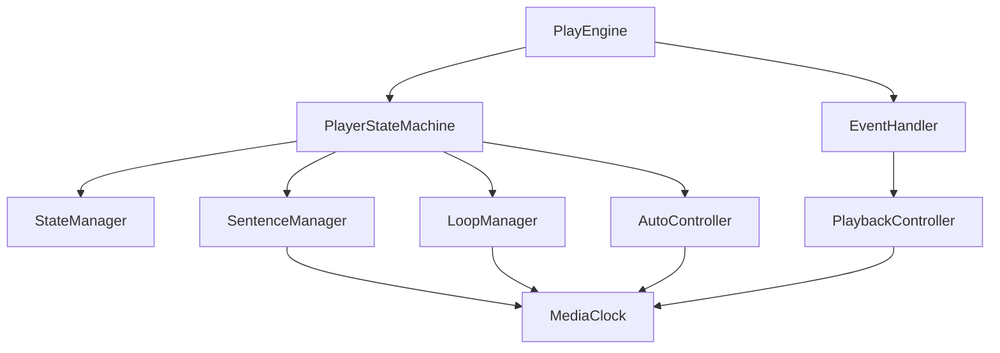

# 播放器引擎 V3 技术规范

## 📋 目录

- [1. 概述](#1-概述)
- [2. 架构设计](#2-架构设计)
- [3. 状态机设计](#3-状态机设计)
- [4. 核心组件规范](#4-核心组件规范)
- [5. 数据流设计](#5-数据流设计)
- [6. 接口定义](#6-接口定义)
- [7. 错误处理](#7-错误处理)
- [8. 性能要求](#8-性能要求)
- [9. 测试策略](#9-测试策略)
- [10. 迁移计划](#10-迁移计划)

## 1. 概述

### 1.1 项目背景

当前播放器引擎（V2）存在以下问题：

- 复杂的意图系统导致维护困难
- 分散的状态管理增加调试复杂度
- 六阶段数据流造成性能开销
- 策略系统过于抽象，难以理解

### 1.2 设计目标

**主要目标**：

- 🎯 **简化架构**: 使用状态机统一管理播放逻辑
- 🔍 **提高可调试性**: 状态转换路径清晰，易于追踪
- ⚡ **优化性能**: 减少不必要的计算和状态检查
- 🛠 **增强可维护性**: 代码结构清晰，职责分离明确

**次要目标**：

- 保持向后兼容性
- 支持渐进式迁移
- 提供更好的开发体验

### 1.3 核心原则

1. **单一职责原则**: 每个组件只负责一个特定功能
2. **状态驱动**: 所有播放行为由状态机驱动
3. **事件驱动**: 通过事件进行组件间通信
4. **可预测性**: 相同输入产生相同输出
5. **可测试性**: 所有组件都能独立测试

## 2. 架构设计

### 2.1 整体架构

```
┌─────────────────────────────────────────────────────────────┐
│                    播放器引擎 V3                            │
├─────────────────────────────────────────────────────────────┤
│  用户接口层 (Public API)                                    │
│  ┌─────────────────┐  ┌─────────────────┐                   │
│  │   PlayEngine    │  │   EventEmitter  │                   │
│  └─────────────────┘  └─────────────────┘                   │
├─────────────────────────────────────────────────────────────┤
│  核心状态层 (Core State Layer)                              │
│  ┌────────────────────┐  ┌─────────────────┐                │
│  │ PlayerStateMachine │  │  StateManager   │                │
│  └────────────────────┘  └─────────────────┘                │
├─────────────────────────────────────────────────────────────┤
│  功能模块层 (Feature Modules)                               │
│  ┌─────────────────┐ ┌─────────────────┐ ┌─────────────────┐│
│  │ SentenceManager │ │  LoopManager    │ │ AutoController  ││
│  └─────────────────┘ └─────────────────┘ └─────────────────┘│
├─────────────────────────────────────────────────────────────┤
│  控制层 (Control Layer)                                     │
│  ┌──────────────────┐  ┌─────────────────┐                  │
│  │PlaybackController│  │  EventHandler   │                  │
│  └──────────────────┘  └─────────────────┘                  │
├─────────────────────────────────────────────────────────────┤
│  基础设施层 (Infrastructure)                                │
│  ┌─────────────────┐ ┌─────────────────┐ ┌─────────────────┐│
│  │   MediaClock    │ │    Logger       │ │   TypeDefs      ││
│  └─────────────────┘ └─────────────────┘ └─────────────────┘│
└─────────────────────────────────────────────────────────────┘
```

### 2.2 分层职责

| 层级       | 职责               | 组件                                         |
| ---------- | ------------------ | -------------------------------------------- |
| 用户接口层 | 对外提供统一API    | PlayEngine, EventEmitter                     |
| 核心状态层 | 状态管理和转换     | PlayerStateMachine, StateManager             |
| 功能模块层 | 具体业务逻辑       | SentenceManager, LoopManager, AutoController |
| 控制层     | 设备控制和事件处理 | PlaybackController, EventHandler             |
| 基础设施层 | 公共服务和工具     | MediaClock, Logger, TypeDefs                 |

### 2.3 依赖关系



## 3. 状态机设计

### 3.1 分层并行状态架构

基于XState v5设计，采用分层并行状态机，将复杂的线性状态转换为领域分离的并行子状态机：

```typescript
// 分层并行状态架构
interface PlayerStateMachineSchema {
  value: {
    // 并行域1：播放传输状态
    transport: 'playing' | 'paused' | 'buffering' | 'ended' | 'error'
    // 并行域2：位置控制状态
    positioning: 'idle' | 'seeking'
    // 并行域3：句子跟踪状态
    sentence: {
      tracking: 'active' | 'completed' | 'none'
      looping: 'disabled' | 'finite' | 'infinite'
    }
    // 并行域4：自动控制状态
    autoControl: {
      autoPause: 'off' | 'on'
      autoResume: 'off' | 'arming' | 'counting' | 'triggered'
      gapSkip: 'off' | 'armed' | 'skipping'
    }
    // 并行域5：配置编排状态
    config: 'idle' | 'applying' | 'rollbacking'
  }
}

// 状态值枚举（用于类型安全）
export const PlayerStateValues = {
  transport: {
    PLAYING: 'playing',
    PAUSED: 'paused',
    BUFFERING: 'buffering',
    ENDED: 'ended',
    ERROR: 'error'
  },
  positioning: {
    IDLE: 'idle',
    SEEKING: 'seeking'
  },
  sentence: {
    tracking: {
      ACTIVE: 'active',
      COMPLETED: 'completed',
      NONE: 'none'
    },
    looping: {
      DISABLED: 'disabled',
      FINITE: 'finite',
      INFINITE: 'infinite'
    }
  },
  autoControl: {
    autoPause: {
      OFF: 'off',
      ON: 'on'
    },
    autoResume: {
      OFF: 'off',
      ARMING: 'arming',
      COUNTING: 'counting',
      TRIGGERED: 'triggered'
    },
    gapSkip: {
      OFF: 'off',
      ARMED: 'armed',
      SKIPPING: 'skipping'
    }
  },
  config: {
    IDLE: 'idle',
    APPLYING: 'applying',
    ROLLBACKING: 'rollbacking'
  }
} as const

type PlayerStateValue = PlayerStateMachineSchema['value']
```

### 3.2 强类型事件定义

使用Discriminated Unions替代枚举，提供编译时类型安全和更好的可扩展性：

```typescript
// 强类型事件定义（Discriminated Unions）
export type PlayerEvent =
  // 用户交互事件
  | { type: 'USER.TOGGLE_PLAY' }
  | { type: 'USER.PLAY' }
  | { type: 'USER.PAUSE' }
  | { type: 'USER.SEEK'; at: number; reason?: 'drag' | 'jump' | 'click' }

  // 媒体状态事件
  | { type: 'MEDIA.TIME_UPDATE'; now: number; buffered?: TimeRanges }
  | { type: 'MEDIA.ENDED' }
  | {
      type: 'MEDIA.ERROR'
      error: MediaError
      code: string
      severity: 'low' | 'medium' | 'high' | 'critical'
    }
  | { type: 'MEDIA.BUFFERING'; isBuffering: boolean }
  | { type: 'MEDIA.SEEKING'; at: number }
  | { type: 'MEDIA.SEEKED'; at: number }

  // 句子生命周期事件
  | { type: 'SENTENCE.STARTED'; index: number; sentence: SubtitleItem }
  | { type: 'SENTENCE.ENDED'; index: number; sentence: SubtitleItem; isLast?: boolean }
  | { type: 'SENTENCE.CHANGED'; from: number; to: number }

  // 循环控制事件
  | { type: 'LOOP.ENABLE'; mode: LoopMode; count?: number }
  | { type: 'LOOP.DISABLE' }
  | { type: 'LOOP.EXECUTE'; sentenceIndex: number; remaining: number | 'infinite' }
  | { type: 'LOOP.COMPLETED'; totalLoops: number }

  // 自动控制事件
  | { type: 'AUTO.PAUSE_ENABLE' }
  | { type: 'AUTO.PAUSE_DISABLE' }
  | { type: 'AUTO.RESUME_ENABLE'; delay: number }
  | { type: 'AUTO.RESUME_DISABLE' }
  | { type: 'AUTO.RESUME_TIMEOUT' }
  | { type: 'GAP.SKIP_ENABLE'; threshold: number }
  | { type: 'GAP.SKIP_DISABLE' }
  | { type: 'GAP.DETECTED'; size: number; at: number }
  | { type: 'GAP.SKIPPED'; from: number; to: number }

  // 配置管理事件
  | {
      type: 'CONFIG.UPDATE_REQUEST'
      patch: Partial<PlayEngineConfig>
      immediate?: boolean
      id: string
    }
  | { type: 'CONFIG.VALIDATE'; config: Partial<PlayEngineConfig>; context: ValidationContext }
  | { type: 'CONFIG.APPLY'; config: Partial<PlayEngineConfig>; snapshot: ConfigSnapshot }
  | { type: 'CONFIG.APPLIED'; config: PlayEngineConfig; changes: ConfigChange[] }
  | { type: 'CONFIG.ROLLBACK'; snapshotId: string; reason: string }
  | { type: 'CONFIG.CONFLICT'; conflicts: ConfigConflict[]; resolution: ConflictResolution }

  // 系统事件
  | { type: 'SYSTEM.INIT'; config: PlayEngineConfig }
  | { type: 'SYSTEM.DISPOSE' }
  | { type: 'SYSTEM.RESET'; reason: 'error' | 'user' | 'config' }

  // 命令队列事件
  | { type: 'COMMAND.ENQUEUE'; command: Command }
  | { type: 'COMMAND.EXECUTE'; command: Command }
  | { type: 'COMMAND.COMPLETE'; command: Command; result: any }
  | { type: 'COMMAND.ERROR'; command: Command; error: Error }

// 事件类型守卫
export const isUserEvent = (
  event: PlayerEvent
): event is Extract<PlayerEvent, { type: `USER.${string}` }> => event.type.startsWith('USER.')

export const isMediaEvent = (
  event: PlayerEvent
): event is Extract<PlayerEvent, { type: `MEDIA.${string}` }> => event.type.startsWith('MEDIA.')

export const isSentenceEvent = (
  event: PlayerEvent
): event is Extract<PlayerEvent, { type: `SENTENCE.${string}` }> =>
  event.type.startsWith('SENTENCE.')

// 事件创建器（工厂函数）
export const createPlayerEvent = {
  userSeek: (at: number, reason?: 'drag' | 'jump' | 'click'): PlayerEvent => ({
    type: 'USER.SEEK',
    at,
    reason
  }),
  mediaTimeUpdate: (now: number, buffered?: TimeRanges): PlayerEvent => ({
    type: 'MEDIA.TIME_UPDATE',
    now,
    buffered
  }),
  sentenceEnded: (index: number, sentence: SubtitleItem, isLast?: boolean): PlayerEvent => ({
    type: 'SENTENCE.ENDED',
    index,
    sentence,
    isLast
  }),
  configUpdate: (patch: Partial<PlayEngineConfig>, immediate?: boolean): PlayerEvent => ({
    type: 'CONFIG.UPDATE_REQUEST',
    patch,
    immediate,
    id: crypto.randomUUID()
  })
}

// 支持类型
interface ValidationContext {
  currentState: PlayerStateValue
  activeCommands: Command[]
  timestamp: number
}

interface ConfigSnapshot {
  id: string
  config: PlayEngineConfig
  timestamp: number
  checksum: string
}

interface ConfigChange {
  key: keyof PlayEngineConfig
  oldValue: any
  newValue: any
  appliedAt: number
}

interface ConfigConflict {
  key: keyof PlayEngineConfig
  currentValue: any
  requestedValue: any
  conflictType: 'state_dependent' | 'value_constraint' | 'logic_conflict'
  resolution: 'queue' | 'immediate' | 'reject' | 'user_confirm'
  message: string
}

type ConflictResolution = 'auto_resolve' | 'queue_pending' | 'user_required' | 'rollback'
```

### 3.3 上下文定义（Context）

状态机上下文包含决策所需的最小充分信息，避免冗余和派生状态：

```typescript
// 状态机上下文
interface PlayerStateMachineContext {
  // 播放状态
  currentTime: number
  duration: number
  playbackRate: number
  volume: number
  muted: boolean

  // 句子状态
  currentSentenceIndex: number
  sentences: SubtitleItem[]
  sentenceProgress: number // 当前句子播放进度 0-1

  // 循环状态
  loopMode: LoopMode
  loopCount: number
  loopRemaining: number | 'infinite'

  // 自动控制状态
  autoPauseEnabled: boolean
  autoResumeEnabled: boolean
  autoResumeDelay: number
  gapSkipEnabled: boolean
  gapSkipThreshold: number

  // 定时器和异步操作句柄
  timers: {
    autoResume: NodeJS.Timeout | null
    gapDetection: NodeJS.Timeout | null
  }
  services: {
    seekOperation: Promise<void> | null
    configValidation: Promise<ValidationResult> | null
  }

  // 命令队列
  commandQueue: Command[]
  activeCommand: Command | null

  // 配置快照
  configSnapshot: ConfigSnapshot | null
  configHistory: ConfigSnapshot[]

  // 错误状态
  lastError: PlayEngineError | null
  errorCount: number
}

// 命令定义
interface Command {
  id: string
  type: 'play' | 'pause' | 'seek' | 'updateConfig' | 'reset'
  payload?: any
  priority: 'low' | 'normal' | 'high' | 'critical'
  timestamp: number
  timeout?: number
  retryCount?: number
  maxRetries?: number
}

// 配置验证结果
interface ValidationResult {
  valid: boolean
  errors: ConfigError[]
  warnings: ConfigWarning[]
  conflicts: ConfigConflict[]
}

interface ConfigError {
  key: keyof PlayEngineConfig
  value: any
  message: string
  code: string
}

interface ConfigWarning {
  key: keyof PlayEngineConfig
  message: string
  suggestion?: string
}
```

### 3.4 并行状态转换逻辑

基于分层并行架构，状态转换通过Guards、Actions和Services实现：

#### 并行域间协调

| 触发域                 | 事件                | 影响域            | 协调逻辑             | 实现方式              |
| ---------------------- | ------------------- | ----------------- | -------------------- | --------------------- |
| transport              | SENTENCE.ENDED      | sentence.tracking | 句子完成触发循环检查 | raise internal event  |
| sentence.looping       | LOOP.EXECUTE        | positioning       | 循环执行触发seek操作 | invoke seek service   |
| autoControl.autoResume | AUTO.RESUME_TIMEOUT | transport         | 自动恢复触发播放     | send event to parent  |
| config                 | CONFIG.APPLY        | all domains       | 配置应用影响所有域   | broadcast to children |

#### Guards（守卫条件）

```typescript
interface PlayerStateMachineGuards {
  // 循环相关守卫
  shouldLoop: (context: PlayerStateMachineContext) => boolean
  hasLoopRemaining: (context: PlayerStateMachineContext) => boolean
  isInfiniteLoop: (context: PlayerStateMachineContext) => boolean

  // 自动控制守卫
  shouldAutoPause: (context: PlayerStateMachineContext) => boolean
  shouldAutoResume: (context: PlayerStateMachineContext) => boolean
  shouldSkipGap: (context: PlayerStateMachineContext, event: PlayerEvent) => boolean

  // 配置更新守卫
  canApplyConfigNow: (context: PlayerStateMachineContext, event: PlayerEvent) => boolean
  hasConfigConflicts: (context: PlayerStateMachineContext, event: PlayerEvent) => boolean

  // 句子边界守卫
  isLastSentence: (context: PlayerStateMachineContext) => boolean
  hasNextSentence: (context: PlayerStateMachineContext) => boolean
}

// Guards 实现示例
const guards: PlayerStateMachineGuards = {
  shouldLoop: ({ loopMode, loopRemaining }) =>
    loopMode !== 'disabled' && (loopRemaining === 'infinite' || loopRemaining > 0),

  shouldAutoPause: ({ autoPauseEnabled }) => autoPauseEnabled,

  canApplyConfigNow: ({ commandQueue, activeCommand }, event) =>
    activeCommand === null && commandQueue.length === 0,

  shouldSkipGap: ({ gapSkipEnabled, gapSkipThreshold }, event) =>
    gapSkipEnabled && isGapDetectionEvent(event) && event.size > gapSkipThreshold
}
```

#### Actions（动作）

```typescript
interface PlayerStateMachineActions {
  // 上下文更新动作
  updateCurrentTime: (context: PlayerStateMachineContext, event: PlayerEvent) => void
  updateSentenceIndex: (context: PlayerStateMachineContext, event: PlayerEvent) => void
  decrementLoopCount: (context: PlayerStateMachineContext) => void

  // 命令队列动作
  enqueueCommand: (context: PlayerStateMachineContext, event: PlayerEvent) => void
  dequeueCommand: (context: PlayerStateMachineContext) => void

  // 配置管理动作
  saveConfigSnapshot: (context: PlayerStateMachineContext, event: PlayerEvent) => void
  applyConfigPatch: (context: PlayerStateMachineContext, event: PlayerEvent) => void

  // 定时器管理动作
  startAutoResumeTimer: (context: PlayerStateMachineContext, event: PlayerEvent) => void
  cancelAutoResumeTimer: (context: PlayerStateMachineContext) => void

  // 错误处理动作
  recordError: (context: PlayerStateMachineContext, event: PlayerEvent) => void
  clearError: (context: PlayerStateMachineContext) => void
}
```

#### Services（服务）

```typescript
interface PlayerStateMachineServices {
  // 异步媒体操作
  seekService: (context: PlayerStateMachineContext, event: PlayerEvent) => Promise<SeekResult>
  playService: (context: PlayerStateMachineContext) => Promise<PlayResult>
  pauseService: (context: PlayerStateMachineContext) => Promise<PauseResult>

  // 配置管理服务
  validateConfigService: (config: Partial<PlayEngineConfig>) => Promise<ValidationResult>
  applyConfigService: (
    context: PlayerStateMachineContext,
    config: Partial<PlayEngineConfig>
  ) => Promise<ConfigResult>

  // 间隙检测服务
  gapDetectionService: (context: PlayerStateMachineContext) => Promise<GapDetectionResult>

  // 句子管理服务
  sentenceNavigationService: (target: number | 'next' | 'previous') => Promise<NavigationResult>
}
```

#### Activities（活动）

长生命周期副作用管理：

```typescript
interface PlayerStateMachineActivities {
  // 时钟活动
  mediaClockActivity: {
    start: (context: PlayerStateMachineContext) => Subscription
    stop: (subscription: Subscription) => void
  }

  // 配置监听活动
  configWatchActivity: {
    start: (context: PlayerStateMachineContext) => Subscription
    stop: (subscription: Subscription) => void
  }

  // 性能监控活动
  performanceMonitorActivity: {
    start: (context: PlayerStateMachineContext) => Subscription
    stop: (subscription: Subscription) => void
  }
}

// Subscription 接口
interface Subscription {
  unsubscribe(): void
  closed: boolean
}
```

### 3.5 XState v5 状态机配置示例

基于新架构的实际状态机配置：

```typescript
import { setup, createMachine, fromPromise, raise, enqueueActions, choose } from 'xstate'

// XState v5 状态机设置
const playerStateMachine = setup({
  types: {} as {
    context: PlayerStateMachineContext
    events: PlayerEvent
    actors: {
      seekService: { input: { at: number }; output: SeekResult }
      validateConfigService: {
        input: { config: Partial<PlayEngineConfig> }
        output: ValidationResult
      }
      gapDetectionService: { input: {}; output: GapDetectionResult }
    }
  },

  // Guards
  guards: {
    shouldLoop: ({ context }) =>
      context.loopMode !== 'disabled' &&
      (context.loopRemaining === 'infinite' || context.loopRemaining > 0),

    shouldAutoPause: ({ context }) => context.autoPauseEnabled,

    shouldAutoResume: ({ context }) => context.autoResumeEnabled,

    shouldSkipGap: ({ context }, event) => {
      if (!context.gapSkipEnabled) return false
      if (event.type !== 'GAP.DETECTED') return false
      return event.size > context.gapSkipThreshold
    },

    canApplyConfigNow: ({ context }) =>
      context.activeCommand === null && context.commandQueue.length === 0,

    isLastSentence: ({ context }) => context.currentSentenceIndex >= context.sentences.length - 1
  },

  // Actions
  actions: {
    updateCurrentTime: ({ context }, event) => {
      if (event.type === 'MEDIA.TIME_UPDATE') {
        context.currentTime = event.now
      }
    },

    updateSentenceIndex: ({ context }, event) => {
      if (event.type === 'SENTENCE.ENDED') {
        context.currentSentenceIndex = event.index
      }
    },

    decrementLoopCount: ({ context }) => {
      if (typeof context.loopRemaining === 'number' && context.loopRemaining > 0) {
        context.loopRemaining--
      }
    },

    enqueueCommand: ({ context }, event) => {
      if (event.type === 'COMMAND.ENQUEUE') {
        context.commandQueue.push(event.command)
      }
    },

    saveConfigSnapshot: ({ context }) => {
      context.configSnapshot = {
        id: crypto.randomUUID(),
        config: { ...context } as PlayEngineConfig,
        timestamp: Date.now(),
        checksum: generateChecksum(context)
      }
    },

    startAutoResumeTimer: ({ context }) => {
      if (context.timers.autoResume) {
        clearTimeout(context.timers.autoResume)
      }
      context.timers.autoResume = setTimeout(() => {
        // 发送自动恢复事件
      }, context.autoResumeDelay)
    },

    cancelAutoResumeTimer: ({ context }) => {
      if (context.timers.autoResume) {
        clearTimeout(context.timers.autoResume)
        context.timers.autoResume = null
      }
    },

    recordError: ({ context }, event) => {
      if (event.type === 'MEDIA.ERROR') {
        context.lastError = new PlayEngineError(event.error.message, event.code, event.severity)
        context.errorCount++
      }
    }
  },

  // Actors/Services
  actors: {
    seekService: fromPromise(async ({ input }) => {
      await playbackController.seek(input.at)
      return { success: true, position: input.at }
    }),

    validateConfigService: fromPromise(async ({ input }) => {
      return await configManager.validate(input.config)
    }),

    gapDetectionService: fromPromise(async ({ input }) => {
      // 间隙检测逻辑
      return { hasGap: false, size: 0 }
    })
  },

  // Activities
  activities: {
    mediaClockActivity: {
      start: ({ context }) => {
        const subscription = mediaClock.subscribe((time) => {
          // 发送时间更新事件
        })
        return { unsubscribe: () => subscription.unsubscribe(), closed: false }
      },
      stop: (subscription) => subscription.unsubscribe()
    }
  }
}).createMachine({
  id: 'playerEngine',
  type: 'parallel', // 并行状态机

  context: {
    // 初始化上下文
    currentTime: 0,
    duration: 0,
    playbackRate: 1,
    volume: 1,
    muted: false,

    currentSentenceIndex: -1,
    sentences: [],
    sentenceProgress: 0,

    loopMode: 'disabled',
    loopCount: 0,
    loopRemaining: 0,

    autoPauseEnabled: false,
    autoResumeEnabled: false,
    autoResumeDelay: 2000,
    gapSkipEnabled: false,
    gapSkipThreshold: 1000,

    timers: {
      autoResume: null,
      gapDetection: null
    },
    services: {
      seekOperation: null,
      configValidation: null
    },

    commandQueue: [],
    activeCommand: null,

    configSnapshot: null,
    configHistory: [],

    lastError: null,
    errorCount: 0
  },

  states: {
    // 并行域1：播放传输状态
    transport: {
      initial: 'paused',
      states: {
        paused: {
          on: {
            'USER.PLAY': { target: 'playing' },
            'USER.TOGGLE_PLAY': { target: 'playing' }
          }
        },
        playing: {
          entry: ['resumePlayback'],
          activities: ['mediaClockActivity'],
          on: {
            'USER.PAUSE': { target: 'paused' },
            'USER.TOGGLE_PLAY': { target: 'paused' },
            'MEDIA.ENDED': { target: 'ended' },
            'MEDIA.ERROR': { target: 'error', actions: ['recordError'] },
            'MEDIA.TIME_UPDATE': { actions: ['updateCurrentTime'] }
          }
        },
        buffering: {
          on: {
            'MEDIA.TIME_UPDATE': { target: 'playing' }
          }
        },
        ended: {
          type: 'final'
        },
        error: {
          on: {
            'SYSTEM.RESET': { target: 'paused', actions: ['clearError'] }
          }
        }
      }
    },

    // 并行域2：位置控制状态
    positioning: {
      initial: 'idle',
      states: {
        idle: {
          on: {
            'USER.SEEK': { target: 'seeking' }
          }
        },
        seeking: {
          invoke: {
            src: 'seekService',
            input: ({ event }) => ({ at: event.at }),
            onDone: { target: 'idle' },
            onError: { target: 'idle', actions: ['recordError'] }
          }
        }
      }
    },

    // 并行域3：句子状态
    sentence: {
      type: 'parallel',
      states: {
        tracking: {
          initial: 'none',
          states: {
            none: {
              on: {
                'SENTENCE.STARTED': { target: 'active', actions: ['updateSentenceIndex'] }
              }
            },
            active: {
              on: {
                'SENTENCE.ENDED': {
                  target: 'completed',
                  actions: ['updateSentenceIndex']
                }
              }
            },
            completed: {
              always: [{ target: 'none', guard: 'isLastSentence' }, { target: 'none' }]
            }
          }
        },

        looping: {
          initial: 'disabled',
          states: {
            disabled: {
              on: {
                'LOOP.ENABLE': { target: 'finite' }
              }
            },
            finite: {
              on: {
                'LOOP.DISABLE': { target: 'disabled' },
                'SENTENCE.ENDED': {
                  actions: [
                    choose([
                      {
                        guard: 'shouldLoop',
                        actions: [
                          'decrementLoopCount',
                          raise({ type: 'LOOP.EXECUTE', sentenceIndex: 0, remaining: 0 })
                        ]
                      }
                    ])
                  ]
                }
              }
            },
            infinite: {
              on: {
                'LOOP.DISABLE': { target: 'disabled' },
                'SENTENCE.ENDED': {
                  actions: [
                    raise({ type: 'LOOP.EXECUTE', sentenceIndex: 0, remaining: 'infinite' })
                  ]
                }
              }
            }
          }
        }
      }
    },

    // 并行域4：自动控制
    autoControl: {
      type: 'parallel',
      states: {
        autoPause: {
          initial: 'off',
          states: {
            off: {
              on: {
                'AUTO.PAUSE_ENABLE': { target: 'on' }
              }
            },
            on: {
              on: {
                'AUTO.PAUSE_DISABLE': { target: 'off' },
                'SENTENCE.ENDED': {
                  actions: [raise({ type: 'USER.PAUSE' })],
                  guard: 'shouldAutoPause'
                }
              }
            }
          }
        },

        autoResume: {
          initial: 'off',
          states: {
            off: {
              on: {
                'AUTO.RESUME_ENABLE': { target: 'arming' }
              }
            },
            arming: {
              on: {
                'AUTO.RESUME_DISABLE': { target: 'off' },
                'USER.PAUSE': { target: 'counting' }
              }
            },
            counting: {
              entry: ['startAutoResumeTimer'],
              exit: ['cancelAutoResumeTimer'],
              after: {
                2000: { target: 'triggered' }
              },
              on: {
                'USER.PLAY': { target: 'off' },
                'AUTO.RESUME_DISABLE': { target: 'off' }
              }
            },
            triggered: {
              entry: [raise({ type: 'USER.PLAY' })],
              always: { target: 'off' }
            }
          }
        },

        gapSkip: {
          initial: 'off',
          states: {
            off: {
              on: {
                'GAP.SKIP_ENABLE': { target: 'armed' }
              }
            },
            armed: {
              on: {
                'GAP.SKIP_DISABLE': { target: 'off' },
                'GAP.DETECTED': {
                  target: 'skipping',
                  guard: 'shouldSkipGap'
                }
              }
            },
            skipping: {
              invoke: {
                src: 'seekService',
                input: ({ event }) => ({ at: event.to }),
                onDone: { target: 'armed' },
                onError: { target: 'armed' }
              }
            }
          }
        }
      }
    },

    // 并行域5：配置管理
    config: {
      initial: 'idle',
      states: {
        idle: {
          on: {
            'CONFIG.UPDATE_REQUEST': {
              target: 'applying',
              guard: 'canApplyConfigNow',
              actions: ['saveConfigSnapshot']
            }
          }
        },
        applying: {
          invoke: {
            src: 'validateConfigService',
            input: ({ event }) => ({ config: event.patch }),
            onDone: {
              target: 'idle',
              actions: ['applyConfigPatch']
            },
            onError: {
              target: 'rollbacking'
            }
          }
        },
        rollbacking: {
          // 配置回滚逻辑
          always: { target: 'idle' }
        }
      }
    }
  }
})

// 辅助函数
function generateChecksum(context: PlayerStateMachineContext): string {
  return btoa(JSON.stringify(context)).slice(0, 16)
}
```

## 4. 核心组件规范

### 4.1 PlayEngine (主入口) - 命令队列架构

**职责**: 对外提供统一API，通过命令队列管理操作顺序性和可撤销性

```typescript
interface PlayEngine {
  // 生命周期管理
  init(config: PlayEngineConfig): Promise<EngineInitResult>
  dispose(): Promise<void>

  // 命令式播放控制（所有操作通过命令队列）
  play(): Promise<CommandResult>
  pause(): Promise<CommandResult>
  togglePlay(): Promise<CommandResult>
  seek(time: number, reason: SeekReason = 'programmatic'): Promise<CommandResult>

  // 状态查询（只读操作，不经过命令队列）
  getState(): Readonly<PlayerStateValue>
  getContext(): Readonly<PlayerStateMachineContext>
  getSnapshot(): PlayerSnapshot
  getCurrentTime(): number
  getDuration(): number

  // 增强配置热更新（原子性和事务性）
  updateConfig(
    patch: Partial<PlayEngineConfig>,
    options?: ConfigUpdateOptions
  ): Promise<ConfigUpdateResult>
  getConfig(): Readonly<PlayEngineConfig>
  getPendingConfig(): Readonly<Partial<PlayEngineConfig>> | null
  rollbackConfig(snapshotId?: string): Promise<ConfigRollbackResult>
  getConfigHistory(): ReadonlyArray<ConfigSnapshot>

  // 强类型事件系统
  on<K extends keyof PlayEngineEvents>(event: K, listener: PlayEngineEvents[K]): UnsubscribeFunction
  off<K extends keyof PlayEngineEvents>(event: K, listener: PlayEngineEvents[K]): void
  once<K extends keyof PlayEngineEvents>(
    event: K,
    listener: PlayEngineEvents[K]
  ): UnsubscribeFunction

  // 命令队列管理
  getCommandQueue(): ReadonlyArray<Command>
  cancelCommand(commandId: string): boolean
  clearCommandQueue(): void

  // 调试和诊断支持
  getDebugInfo(): EngineDebugInfo
  exportStateMachine(): StateMachineExport
  exportEventLog(): EventLogExport
  getPerformanceMetrics(): PerformanceMetrics

  // 故障恢复和重放
  exportSnapshot(): EngineSnapshot
  loadSnapshot(snapshot: EngineSnapshot): Promise<void>
  replay(events: PlayerEvent[], fromSnapshot?: EngineSnapshot): Promise<ReplayResult>
}

// 支持类型
type SeekReason = 'user' | 'programmatic' | 'loop' | 'gap_skip' | 'sentence_nav'

interface EngineInitResult {
  success: boolean
  version: string
  capabilities: EngineCapability[]
  errors?: InitError[]
  warnings?: InitWarning[]
}

interface CommandResult {
  success: boolean
  commandId: string
  executionTime: number
  error?: PlayEngineError
  metadata?: Record<string, any>
}

interface ConfigUpdateOptions {
  immediate?: boolean
  validateOnly?: boolean
  timeout?: number
  onConflict?: 'reject' | 'queue' | 'force' | 'user_confirm'
  rollbackOnFailure?: boolean
}

interface PlayerSnapshot {
  state: PlayerStateValue
  context: PlayerStateMachineContext
  timestamp: number
  version: string
  checksum: string
}

type UnsubscribeFunction = () => void
type EngineCapability = 'seek' | 'loop' | 'auto_pause' | 'gap_skip' | 'config_hot_reload'

interface InitError {
  code: string
  message: string
  severity: 'low' | 'medium' | 'high' | 'critical'
  component?: string
}

interface InitWarning {
  code: string
  message: string
  suggestion?: string
}
```

**实现要求**:

- 必须使用 TypeScript 严格模式
- 所有公共方法必须有 JSDoc 注释
- 错误处理必须通过 Promise reject 或事件形式
- 必须支持异步初始化和清理

### 4.2 PlayerStateMachine (状态机) - 纯决策引擎

**职责**: 管理状态转换逻辑，不直接执行副作用，所有IO操作通过Services实现

```typescript
interface PlayerStateMachine {
  // 状态查询（只读）
  getCurrentState(): PlayerStateValue
  getContext(): Readonly<PlayerStateMachineContext>
  getSnapshot(): StateMachineSnapshot

  // 事件发送（纯函数）
  send(event: PlayerEvent): StateMachineSnapshot
  canSend(event: PlayerEvent): boolean

  // 状态监听（只为可观测性）
  subscribe(observer: StateMachineObserver): Subscription
  onTransition(listener: TransitionListener): Subscription
  onStateChange(listener: StateChangeListener): Subscription

  // 生命周期管理
  start(): StateMachineSnapshot
  stop(): void
  restart(snapshot?: StateMachineSnapshot): StateMachineSnapshot

  // 调试和诊断
  getStateHistory(): ReadonlyArray<StateTransitionRecord>
  getMetrics(): StateMachineMetrics
  exportDefinition(): StateMachineDefinition
  validateTransition(from: PlayerStateValue, event: PlayerEvent): TransitionValidationResult

  // 时间旅行调试
  getTransitionPath(targetState: PlayerStateValue): TransitionPath | null
  canReach(targetState: PlayerStateValue): boolean
  simulate(events: PlayerEvent[]): SimulationResult
}

// 支持接口
interface StateMachineSnapshot {
  value: PlayerStateValue
  context: PlayerStateMachineContext
  event: PlayerEvent
  timestamp: number
  changed: boolean
  done: boolean
  can: (event: PlayerEvent) => boolean
}

interface StateMachineObserver {
  next: (snapshot: StateMachineSnapshot) => void
  error?: (error: Error) => void
  complete?: () => void
}

type StateChangeListener = (
  state: PlayerStateValue,
  event: PlayerEvent,
  context: PlayerStateMachineContext
) => void

type TransitionListener = (transition: StateTransitionRecord) => void

interface StateTransitionRecord {
  from: PlayerStateValue
  to: PlayerStateValue
  event: PlayerEvent
  timestamp: number
  duration: number
  guards: GuardEvaluation[]
  actions: ActionExecution[]
}

interface GuardEvaluation {
  name: string
  result: boolean
  duration: number
  error?: Error
}

interface ActionExecution {
  name: string
  success: boolean
  duration: number
  error?: Error
  sideEffects: SideEffect[]
}

interface SideEffect {
  type: 'service_invoke' | 'activity_start' | 'activity_stop' | 'timer_set' | 'timer_clear'
  target: string
  payload?: any
}

interface TransitionValidationResult {
  valid: boolean
  guards: GuardValidation[]
  actions: ActionValidation[]
  path: string[]
  issues: ValidationIssue[]
}

interface SimulationResult {
  finalState: PlayerStateValue
  transitions: StateTransitionRecord[]
  errors: Error[]
  duration: number
  stateChanges: number
}
```

**技术要求**:

- 使用 XState 库实现
- 状态转换必须是确定性的
- 必须支持状态历史记录
- 必须提供可视化调试支持

### 4.3 SentenceManager (句子管理) - 纯计算引擎

**职责**: 只负责句子查询、边界检测和导航计算，不执行实际跳转操作

```typescript
interface SentenceManager {
  // 句子查询 (复用 V2 SubtitleIndexCalculator O(log n) 算法)
  getCurrentSentence(time: number): SubtitleItem | null
  getSentenceByIndex(index: number): ReadonlySubtitleItem | null
  getSentenceByTime(time: number): ReadonlySubtitleItem | null
  findSentenceIndex(time: number): number

  // 句子集合查询
  getSentences(): ReadonlyArray<SubtitleItem>
  getSentenceCount(): number
  getNeighboringSentences(index: number, radius: number = 1): NeighboringSentences
  getSentencesInRange(startTime: number, endTime: number): ReadonlyArray<SubtitleItem>

  // 边界检测和进度计算 (复用 V2 TimeMath EPS 逻辑)
  checkSentenceStart(currentTime: number, targetIndex: number): BoundaryCheck
  checkSentenceEnd(currentTime: number, targetIndex: number): BoundaryCheck
  calculateProgress(currentTime: number, sentenceIndex: number): SentenceProgress
  getNextBoundary(currentTime: number): BoundaryInfo | null

  // 导航计算 (不执行实际跳转，只返回目标信息)
  calculateNextSentence(currentIndex: number): NavigationTarget | null
  calculatePreviousSentence(currentIndex: number): NavigationTarget | null
  calculateSentenceJump(fromIndex: number, toIndex: number): NavigationPlan

  // 间隙检测和分析
  detectGap(fromTime: number, toTime: number): GapAnalysis
  getGapsBetweenSentences(): ReadonlyArray<GapInfo>
  calculateOptimalSkipTarget(currentTime: number, threshold: number): SkipTarget | null

  // 虚拟句子支持（无字幕场景）
  generateVirtualSentences(duration: number, segmentLength: number = 5000): ReadonlyArray<VirtualSubtitleItem>
  isVirtualSentence(sentence: SubtitleItem): boolean

  // 配置更新
  updateSentences(sentences: ReadonlyArray<SubtitleItem>): SentenceUpdateResult
  validateSentences(sentences: ReadonlyArray<SubtitleItem>): SentenceValidationResult

  // 性能和诊断
  getIndexingMetrics(): IndexingMetrics
  rebuildIndex(): IndexRebuildResult
  validateIndex(): IndexValidationResult
}

// 支持类型
interface ReadonlySubtitleItem extends Readonly<SubtitleItem> {}

interface NeighboringSentences {
  previous: ReadonlyArray<SubtitleItem>;
  current: SubtitleItem | null;
  next: ReadonlyArray<SubtitleItem>;
  totalRange: { startTime: number; endTime: number };
}

interface BoundaryCheck {
  atBoundary: boolean;
  distance: number; // 毫秒，负值表示过去，正值表示未来
  confidence: number; // 0-1，边界检测的精度
  reason: 'exact' | 'epsilon' | 'prediction' | 'none';
}

interface SentenceProgress {
  index: number;
  progress: number; // 0-1
  elapsed: number; // 已播放毫秒
  remaining: number; // 剩余毫秒
  estimatedEnd: number; // 预计结束时间
}

interface BoundaryInfo {
  type: 'start' | 'end';
  sentenceIndex: number;
  timestamp: number;
  distance: number;
}

interface NavigationTarget {
  index: number;
  sentence: SubtitleItem;
  seekTarget: number; // 建议跳转位置
  distance: number; // 从当前位置的距离
}

interface NavigationPlan {
  fromIndex: number;
  toIndex: number;
  seekTarget: number;
  crossedSentences: number;
  estimatedDuration: number;
  warnings: string[];
}

interface GapAnalysis {
  hasGap: boolean;
  gapSize: number;
  gapStart: number;
  gapEnd: number;
  confidence: number;
  shouldSkip: boolean;
  reason: string;
}

interface GapInfo {
  beforeSentence: number;
  afterSentence: number;
  startTime: number;
  endTime: number;
  duration: number;
  type: 'silence' | 'pause' | 'chapter_break' | 'unknown';
}

interface SkipTarget {
  targetTime: number;
  targetSentence: number;
  skippedDuration: number;
  reason: string;
  confidence: number;
}

interface VirtualSubtitleItem extends SubtitleItem {
  virtual: true;
  segmentIndex: number;
}

  // 配置管理
  updateSubtitles(subtitles: SubtitleItem[]): void
  setCurrentIndex(index: number): void

  // 事件发送
  onSentenceChange: EventEmitter<SentenceChangeEvent>
  onSentenceEnd: EventEmitter<SentenceEndEvent>
}
```

**实现要求**:

- 必须支持高精度时间比较 (复用 V2 TimeMath.EPS 和边界检测算法)
- 句子边界检测必须稳定，避免抖动 (复用 V2 的边界抖动检测逻辑)
- 必须支持空字幕场景
- 性能要求：O(log n) 时间复杂度查找 (复用 V2 SubtitleIndexCalculator 的二分搜索)

### 4.4 LoopManager (循环管理) - 纯状态管理

**职责**: 只管理循环状态和逻辑判断，不执行seek操作

```typescript
interface LoopManager {
  // 循环配置管理
  configure(config: LoopConfiguration): LoopConfigResult
  getConfiguration(): Readonly<LoopConfiguration>
  validateConfiguration(config: Partial<LoopConfiguration>): ValidationResult

  // 循环状态查询
  getCurrentState(): Readonly<LoopState>
  shouldLoop(context: LoopContext): LoopDecision
  calculateNextLoop(currentLoop: number): LoopCalculation

  // 循环计数管理
  initializeLoop(mode: LoopMode, count?: number): LoopInitResult
  decrementLoop(): LoopDecrementResult
  resetLoop(): LoopResetResult
  completeLoop(): LoopCompletionResult

  // 循环进度跟踪
  getLoopProgress(): LoopProgress
  getLoopHistory(): ReadonlyArray<LoopRecord>
  getLoopStatistics(): LoopStatistics

  // 循环策略计算
  calculateLoopStrategy(sentenceIndex: number, duration: number): LoopStrategy
  evaluateLoopConditions(context: LoopEvaluationContext): LoopEvaluation
  predictLoopBehavior(scenario: LoopScenario): LoopPrediction

  // 事件监听和状态更新
  subscribe(observer: LoopObserver): Subscription
  getStateChangeEvents(): ReadonlyArray<LoopStateChangeEvent>
}
```

**实现要求**:

- 支持有限循环和无限循环
- 循环计数必须持久化
- 必须与 SentenceManager 协同工作
- 循环执行必须是原子操作

### 4.5 AutoController (自动控制) - 策略评估引擎

**职责**: 评估自动控制策略和算法，不执行实际操作

```typescript
interface AutoController {
  // 配置管理
  configure(config: AutoControlConfiguration): AutoControlResult
  getConfiguration(): Readonly<AutoControlConfiguration>
  validateConfiguration(config: Partial<AutoControlConfiguration>): ValidationResult

  // 自动暂停评估
  shouldAutoPause(context: AutoPauseContext): AutoPauseDecision
  calculatePauseStrategy(sentenceEnd: SentenceEndContext): PauseStrategy
  evaluatePauseTiming(context: PauseTimingContext): TimingEvaluation

  // 自动恢复评估
  shouldAutoResume(context: AutoResumeContext): AutoResumeDecision
  calculateResumeDelay(pauseContext: PauseContext): ResumeDelayCalculation
  evaluateResumeConditions(context: ResumeConditionContext): ConditionEvaluation

  // 间隙检测和分析
  analyzeGap(gapContext: GapAnalysisContext): GapAnalysisResult
  shouldSkipGap(gapInfo: GapInfo, threshold: number): GapSkipDecision
  calculateSkipStrategy(gap: GapInfo): GapSkipStrategy

  // 智能策略计算
  calculateOptimalStrategy(userBehavior: UserBehaviorProfile): OptimalStrategy
  predictUserIntent(interactionHistory: InteractionHistory): IntentPrediction
  adaptToUserPreferences(preferences: UserPreferences): AdaptationResult

  // 状态评估和监控
  getCurrentState(): Readonly<AutoControlState>
  evaluateCurrentStrategy(): StrategyEvaluation
  getPerformanceMetrics(): AutoControlMetrics

  // 事件监听
  subscribe(observer: AutoControlObserver): Subscription
  getDecisionEvents(): ReadonlyArray<AutoControlDecisionEvent>
}
```

**实现要求**:

- 定时器必须可取消和重置
- 间隙检测必须可配置阈值
- 所有自动操作必须可手动中断
- 必须处理组件销毁时的清理

### 4.6 PlaybackController (播放控制) - 纯IO适配器

**职责**: 纯粹的媒体IO适配器，封装所有媒体元素操作，不持有状态

```typescript
interface PlaybackController {
  // 连接管理 (从 V2 VideoController 扩展)
  connect(videoElement: HTMLVideoElement): void
  disconnect(): void
  isConnected(): boolean

  // 播放控制 (复用 V2 VideoController 接口)
  play(): Promise<void>
  pause(): void
  seek(time: number): void

  // 状态查询 (复用 V2 VideoController 接口)
  getCurrentTime(): number
  getDuration(): number
  isPaused(): boolean
  getPlaybackRate(): number
  getVolume(): number

  // 属性设置 (复用 V2 VideoController 接口)
  setPlaybackRate(rate: number): void
  setVolume(volume: number): void
  setMuted(muted: boolean): void

  // 事件监听 (基于 V2 MediaClock 事件系统设计)
  onTimeUpdate: EventEmitter<TimeUpdateEvent>
  onPlay: EventEmitter<PlayEvent>
  onPause: EventEmitter<PauseEvent>
  onSeeking: EventEmitter<SeekingEvent>
  onSeeked: EventEmitter<SeekedEvent>
  onEnded: EventEmitter<EndedEvent>
  onError: EventEmitter<ErrorEvent>
}
```

**实现要求**:

- 必须处理视频元素的所有异常情况
- 播放操作必须返回 Promise
- 必须支持连接状态检查
- 所有事件必须去重和节流 (复用 V2 MediaClock 的去重逻辑)

### 4.7 ConfigManager (配置管理) - 事务化配置系统

**职责**: 原子性配置管理和Schema驱动的热更新系统

````typescript
interface ConfigManager {
  // 配置分类和更新
  updateConfig(key: string, value: any, immediate?: boolean): Promise<ConfigUpdateResult>
  getConfig(): PlayEngineConfig
  getPendingConfig(): Partial<PlayEngineConfig>

  // 配置应用时机
  canApplyConfigAt(state: PlayerState): boolean
  getOptimalUpdateTiming(): PlayerState[]

  // 冲突处理
  validateConfig(config: Partial<PlayEngineConfig>): ConfigValidationResult
  resolveConflict(currentState: PlayerState, newConfig: any): ConflictResolution

  // 配置历史和回滚
  saveConfigSnapshot(): void
  rollbackConfig(): boolean
  getConfigHistory(): ConfigSnapshot[]

  // 事件发送
  onConfigChanged: EventEmitter<ConfigChangeEvent>
  onConfigConflict: EventEmitter<ConfigConflictEvent>
}

**增强配置热更新机制**：

#### 时机策略表（Timing Matrix）

基于Zod Schema驱动的配置热更新系统，使用表驱动的时机策略：

```typescript
// Schema-first 配置定义
const PlayEngineConfigSchema = z.object({
  // 立即生效配置
  volume: z.number().min(0).max(1),
  playbackRate: z.number().min(0.5).max(3),
  muted: z.boolean(),

  // 延迟生效配置
  loopEnabled: z.boolean(),
  loopMode: z.enum(['single', 'playlist', 'random']),
  loopCount: z.number().int().min(0),
  autoPauseEnabled: z.boolean(),
  autoResumeEnabled: z.boolean(),
  autoResumeDelay: z.number().int().min(0).max(10000),
  gapSkipEnabled: z.boolean(),
  gapSkipThreshold: z.number().int().min(0).max(10000)
});

// 时机策略表（表驱动）
const ConfigTimingMatrix: Record<
  keyof PlayEngineConfig,
  Record<string, ConfigTimingStrategy>
> = {
  // 立即生效配置
  volume: {
    '*': { action: 'apply', priority: 10, rollbackable: true }
  },
  playbackRate: {
    'transport.playing': { action: 'apply', priority: 10, rollbackable: true },
    'transport.paused': { action: 'apply', priority: 10, rollbackable: true },
    'transport.buffering': { action: 'queue', delay: 100, priority: 8, rollbackable: true }
  },

  // 延迟生效配置
  loopEnabled: {
    'sentence.tracking.completed': { action: 'apply', priority: 7, rollbackable: true },
    'transport.paused': { action: 'apply', priority: 7, rollbackable: true },
    'sentence.looping.finite': { action: 'queue', priority: 5, conditions: ['loop_cycle_end'], rollbackable: true },
    'sentence.looping.infinite': { action: 'queue', priority: 3, conditions: ['user_confirm'], rollbackable: true },
    '*': { action: 'queue', priority: 1, rollbackable: true }
  },

  autoPauseEnabled: {
    'autoControl.autoPause.off': { action: 'apply', priority: 8, rollbackable: true },
    'autoControl.autoResume.counting': { action: 'apply', priority: 6, conditions: ['immediate_resume'], rollbackable: true },
    '*': { action: 'apply', priority: 5, rollbackable: true }
  }
};

// 时机策略定义
interface ConfigTimingStrategy {
  action: 'apply' | 'queue' | 'reject' | 'confirm';
  priority: number;
  delay?: number;
  conditions?: TimingCondition[];
  rollbackable: boolean;
  metadata?: {
    reason?: string;
    alternatives?: AlternativeStrategy[];
  };
}

type TimingCondition =
  | 'loop_cycle_end'
  | 'user_confirm'
  | 'immediate_resume'
  | 'safe_state'
  | 'no_active_commands';

// 配置冲突检测和解决
function detectConfigConflicts(
  changes: ConfigChange[],
  currentState: PlayerStateValue
): ConfigConflictAnalysis {
  const conflicts: ConfigConflict[] = [];

  changes.forEach(change => {
    const strategy = getTimingStrategy(change.key, currentState);
    const validationResult = validateConfigChange(change, currentState);

    if (!validationResult.valid) {
      conflicts.push({
        key: change.key,
        currentValue: change.oldValue,
        newValue: change.newValue,
        conflictType: validationResult.conflictType,
        resolution: strategy.action,
        severity: validationResult.severity,
        message: validationResult.message,
        suggestedTiming: validationResult.suggestedTiming
      });
    }
  });

  return {
    hasConflicts: conflicts.length > 0,
    conflicts,
    resolutionPlan: generateResolutionPlan(conflicts),
    estimatedResolutionTime: calculateResolutionTime(conflicts)
  };
}

// 冲突类型增强
interface ConfigConflict {
  key: keyof PlayEngineConfig;
  currentValue: any;
  newValue: any;
  conflictType: 'state_dependent' | 'value_constraint' | 'logic_conflict' | 'timing_conflict';
  resolution: 'queue' | 'apply' | 'reject' | 'confirm';
  severity: 'info' | 'warning' | 'error' | 'critical';
  message: string;
  suggestedTiming?: PlayerStateValue;
  metadata?: {
    estimatedDelay?: number;
    alternatives?: string[];
    userActionRequired?: boolean;
  };
}

#### 原子快照机制（Atomic Snapshot + WAL）

```typescript
// 原子快照定义
interface AtomicConfigSnapshot {
  id: string;
  timestamp: number;
  config: PlayEngineConfig;
  state: PlayerStateValue;
  context: Partial<PlayerStateMachineContext>;
  checksum: string;
  version: string;
  metadata: {
    createdBy: 'auto' | 'manual' | 'transaction';
    tags: string[];
    description?: string;
    relatedTransactions: string[];
  };
}

// WAL (写入日志) 系统
interface ConfigWALEntry {
  id: string;
  type: 'BEGIN' | 'CHANGE' | 'COMMIT' | 'ROLLBACK' | 'CHECKPOINT';
  timestamp: number;
  transactionId: string;
  data: {
    operation?: ConfigOperation;
    snapshot?: AtomicConfigSnapshot;
    error?: ConfigError;
  };
  checksum: string;
  previousEntry?: string;
}

interface ConfigOperation {
  type: 'SET' | 'DELETE' | 'MERGE';
  key: keyof PlayEngineConfig;
  oldValue: any;
  newValue: any;
  reason: string;
  metadata: OperationMetadata;
}

// 事务化配置更新
class ConfigTransaction {
  private walEntries: ConfigWALEntry[] = [];
  private snapshots: AtomicConfigSnapshot[] = [];

  async begin(): Promise<string> {
    const snapshot = await this.createSnapshot();
    const walEntry: ConfigWALEntry = {
      id: crypto.randomUUID(),
      type: 'BEGIN',
      timestamp: Date.now(),
      transactionId: this.id,
      data: { snapshot },
      checksum: this.calculateChecksum({ snapshot }),
      previousEntry: this.getLastWALEntry()?.id
    };

    await this.writeWALEntry(walEntry);
    return walEntry.id;
  }

  async applyChanges(changes: ConfigChange[]): Promise<TransactionResult> {
    try {
      // 1. 预验证所有变更
      const validation = await this.validateAllChanges(changes);
      if (!validation.valid) {
        throw new ConfigValidationError(validation.errors);
      }

      // 2. 创建检查点
      const checkpoint = await this.createCheckpoint();

      // 3. 原子性应用所有变更
      const results: ConfigChangeResult[] = [];
      for (const change of changes) {
        const result = await this.applyChange(change);
        results.push(result);

        if (!result.success) {
          await this.rollbackToCheckpoint(checkpoint.id);
          throw new ConfigApplicationError(result.error);
        }
      }

      // 4. 提交事务
      await this.commit();

      return {
        success: true,
        transactionId: this.id,
        appliedChanges: results,
        finalSnapshot: await this.createSnapshot(),
        executionTime: Date.now() - this.startTime
      };

    } catch (error) {
      await this.rollback();
      throw error;
    }
  }

  async rollback(): Promise<void> {
    const initialSnapshot = this.snapshots[0];
    if (initialSnapshot) {
      await this.restoreFromSnapshot(initialSnapshot.id);
    }

    const walEntry: ConfigWALEntry = {
      id: crypto.randomUUID(),
      type: 'ROLLBACK',
      timestamp: Date.now(),
      transactionId: this.id,
      data: { snapshot: initialSnapshot },
      checksum: this.calculateChecksum({ snapshot: initialSnapshot })
    };

    await this.writeWALEntry(walEntry);
  }
}

// 配置差异和合并
function diffConfig(from: PlayEngineConfig, to: Partial<PlayEngineConfig>): ConfigDiff {
  const changes: ConfigChange[] = [];
  const keys = Object.keys(to) as (keyof PlayEngineConfig)[];

  keys.forEach(key => {
    if (from[key] !== to[key]) {
      changes.push({
        key,
        operation: 'SET',
        oldValue: from[key],
        newValue: to[key],
        path: key,
        timestamp: Date.now()
      });
    }
  });

  return {
    changes,
    hasChanges: changes.length > 0,
    affectedKeys: changes.map(c => c.key),
    complexity: calculateDiffComplexity(changes)
  };
}

// 配置合并策略
function mergeConfigs(
  base: PlayEngineConfig,
  changes: Partial<PlayEngineConfig>,
  strategy: MergeStrategy = 'overwrite'
): ConfigMergeResult {
  const merged = { ...base };
  const conflicts: ConfigConflict[] = [];

  Object.keys(changes).forEach(key => {
    const typedKey = key as keyof PlayEngineConfig;
    const baseValue = base[typedKey];
    const newValue = changes[typedKey];

    if (strategy === 'safe' && hasConflict(baseValue, newValue)) {
      conflicts.push(createConflict(typedKey, baseValue, newValue));
    } else {
      merged[typedKey] = newValue as any;
    }
  });

  return {
    config: merged,
    conflicts,
    hasConflicts: conflicts.length > 0,
    strategy
  };
}

// 增强实现要求
/**
 * 增强配置热更新实现要求：
 *
 * 1. **原子性**: 所有配置更新都是原子操作，成功或失败
 * 2. **事务性**: 支持WAL日志和快照机制，可重放和恢复
 * 3. **Schema驱动**: 所有配置都通过Zod Schema验证
 * 4. **时机策略**: 表驱动的时机决策，根据状态选择最优时机
 * 5. **冲突解决**: 智能冲突检测和多策略解决
 * 6. **可观测性**: 完整的事件日志和指标监控
 * 7. **性能优化**: 批量更新、延迟合并和缓存优化
 * 8. **用户体验**: 保证更新过程中播放体验的连续性
 */

#### 配置热更新使用示例

```typescript
// 初始化配置管理器
const configManager = new ConfigManager({
  schema: PlayEngineConfigSchema,
  timingMatrix: ConfigTimingMatrix,
  enableWAL: true,
  enableSnapshots: true,
  maxHistorySize: 100
});

// 立即生效的配置更新
const immediateResult = await configManager.updateConfig({
  volume: 0.8,
  playbackRate: 1.2
}, { immediate: true });

// 延迟生效的配置更新
const delayedResult = await configManager.updateConfig({
  loopCount: 3,
  autoPauseEnabled: false,
  gapSkipThreshold: 2000
}, {
  onConflict: 'queue', // 遇到冲突时自动排队
  timeout: 5000,
  rollbackOnFailure: true
});

// 处理配置更新结果
if (delayedResult.delayed) {
  console.log(`配置将在 ${delayedResult.nextUpdateTiming} 状态时应用`);
}

if (delayedResult.conflicts.length > 0) {
  delayedResult.conflicts.forEach(conflict => {
    switch (conflict.resolution) {
      case 'queue':
        console.log(`配置 ${conflict.key} 已排队等待应用`);
        break;
      case 'confirm':
        showUserConfirmDialog(conflict);
        break;
    }
  });
}

// 监听配置事件
configManager.on('config:applied', (config, state) => {
  console.log(`配置已在状态 ${state} 中成功应用`);
});

configManager.on('config:conflict', (conflict) => {
  if (conflict.metadata?.userActionRequired) {
    handleUserActionRequired(conflict);
  }
});

// 配置回滚
if (needRollback) {
  const rollbackResult = await configManager.rollbackConfig();
  if (rollbackResult.success) {
    console.log(`配置已回滚到快照 ${rollbackResult.snapshotId}`);
  }
}
````

## 5. 数据流设计

### 5.1 数据流架构

```
用户交互 ──┐
          ├─→ EventHandler ──→ PlayerStateMachine ──→ 功能模块 ──→ PlaybackController ──→ 视频元素
媒体事件 ──┘                        ↓
                                状态变更
                                    ↓
                            StateManager ──→ 外部状态 (Zustand)
```

### 5.2 数据流原则

1. **单向数据流**: 数据只能从上层组件流向下层组件
2. **事件驱动**: 组件间通过事件进行通信
3. **状态集中**: 核心状态由状态机统一管理
4. **副作用隔离**: 所有副作用在控制层处理

### 5.3 状态同步策略

```typescript
interface StateManager {
  // 状态同步
  syncToExternal(state: InternalState): void
  syncFromExternal(externalState: ExternalState): void

  // 状态订阅
  subscribeToExternal(callback: StateChangeCallback): UnsubscribeFunction

  // 状态验证
  validateState(state: any): boolean
  reconcileState(internal: InternalState, external: ExternalState): InternalState
}
```

## 6. 接口定义

### 6.1 配置接口

```typescript
interface PlayEngineConfig {
  // 播放设置
  autoPlay: boolean
  playbackRate: number
  volume: number
  muted: boolean

  // 循环设置
  loopEnabled: boolean
  loopMode: LoopMode
  loopCount: number

  // 自动控制设置
  autoPauseEnabled: boolean
  pauseOnSubtitleEnd: boolean
  autoResumeEnabled: boolean
  autoResumeDelay: number

  // 间隙跳跃设置
  gapSkipEnabled: boolean
  gapSkipThreshold: number

  // 调试设置
  enableDebugLogs: boolean
  enableStateLogging: boolean

  // 性能设置
  clockThrottleMs: number
  maxStateHistorySize: number

  // 配置热更新设置
  enableConfigHotUpdate: boolean
  configUpdateSafeStates: PlayerState[]
  maxConfigHistorySize: number
}
```

### 6.2 事件接口

```typescript
interface PlayEngineEvents {
  // 播放状态事件
  'state:change': (state: PlayerState, previousState: PlayerState) => void
  'playback:play': () => void
  'playback:pause': () => void
  'playback:seek': (time: number) => void
  'playback:ended': () => void

  // 句子事件
  'sentence:change': (sentence: SubtitleItem, index: number) => void
  'sentence:end': (sentence: SubtitleItem, index: number) => void

  // 循环事件
  'loop:start': (count: number) => void
  'loop:end': () => void
  'loop:count-change': (remaining: number) => void

  // 自动控制事件
  'auto:pause': () => void
  'auto:resume-start': (delay: number) => void
  'auto:resume-cancel': () => void
  'auto:resume-complete': () => void

  // 配置更新事件
  'config:update-requested': (config: Partial<PlayEngineConfig>, immediate: boolean) => void
  'config:applied': (config: Partial<PlayEngineConfig>, state: PlayerState) => void
  'config:pending': (config: Partial<PlayEngineConfig>, nextTiming: PlayerState) => void
  'config:conflict': (conflict: ConfigConflict) => void
  'config:rollback': (previousConfig: PlayEngineConfig) => void

  // 错误事件
  error: (error: PlayEngineError) => void
}
```

### 6.3 数据类型定义

```typescript
// 循环模式
enum LoopMode {
  SINGLE = 'single', // 单句循环
  PLAYLIST = 'playlist', // 列表循环 (预留)
  RANDOM = 'random' // 随机循环 (预留)
}

// 播放上下文
interface PlaybackContext {
  // 播放器状态
  currentTime: number
  duration: number
  playbackRate: number
  volume: number
  muted: boolean

  // 句子状态
  currentSentenceIndex: number
  sentences: SubtitleItem[]

  // 循环状态
  loopEnabled: boolean
  loopMode: LoopMode
  loopCount: number
  loopRemaining: number

  // 自动控制状态
  autoPauseEnabled: boolean
  autoResumeEnabled: boolean
  autoResumeDelay: number
  gapSkipEnabled: boolean
  gapSkipThreshold: number
}

// 字幕项
interface SubtitleItem {
  id: string
  startTime: number
  endTime: number
  text: string
  confidence?: number
}

// 状态转换记录
interface StateTransition {
  from: PlayerState
  to: PlayerState
  event: PlayerEvent
  timestamp: number
  payload?: any
}

// 错误类型
class PlayEngineError extends Error {
  code: string
  severity: 'low' | 'medium' | 'high' | 'critical'
  context?: any

  constructor(message: string, code: string, severity: PlayEngineError['severity'], context?: any) {
    super(message)
    this.name = 'PlayEngineError'
    this.code = code
    this.severity = severity
    this.context = context
  }
}
```

## 7. 错误处理

### 7.1 错误分类

| 错误类型     | 严重级别 | 处理策略   |
| ------------ | -------- | ---------- |
| 网络错误     | Medium   | 重试机制   |
| 视频格式错误 | High     | 用户提示   |
| 字幕解析错误 | Low      | 静默处理   |
| 状态机错误   | Critical | 重置状态机 |
| 内存泄漏     | High     | 强制清理   |

### 7.2 错误处理流程

```typescript
interface ErrorHandler {
  handleError(error: PlayEngineError): void
  registerErrorRecovery(errorCode: string, recovery: ErrorRecoveryFunction): void
  getErrorHistory(): PlayEngineError[]
  clearErrorHistory(): void
}

type ErrorRecoveryFunction = (error: PlayEngineError) => Promise<boolean>
```

### 7.3 错误恢复策略

1. **自动重试**: 网络相关错误自动重试 3 次
2. **状态回滚**: 状态机错误时回滚到最后已知稳定状态
3. **资源清理**: 内存相关错误时强制清理资源
4. **用户通知**: 严重错误时通过事件通知用户

## 8. 性能要求与可观测性

### 8.1 增强性能指标体系

#### 核心性能指标

| 指标类别       | 指标名称           | 要求    | P95     | P99      | 测量方法              |
| -------------- | ------------------ | ------- | ------- | -------- | --------------------- |
| **响应性**     | 状态转换延迟       | < 5ms   | < 8ms   | < 15ms   | OpenTelemetry Trace   |
|                | 事件处理延迟       | < 10ms  | < 15ms  | < 25ms   | Performance Timeline  |
|                | 句子查找时间       | < 1ms   | < 2ms   | < 5ms    | 自定义指标            |
| **端到端延迟** | 用户操作到媒体响应 | < 100ms | < 150ms | < 300ms  | User Timing API       |
|                | 配置更新到生效     | < 50ms  | < 100ms | < 200ms  | Config Timeline       |
|                | Seek操作到稳定     | < 200ms | < 500ms | < 1000ms | Media Event Tracking  |
| **资源使用**   | 内存使用           | < 50MB  | < 80MB  | < 100MB  | Memory API            |
|                | CPU使用率          | < 30%   | < 50%   | < 70%    | Performance Observer  |
|                | 状态机启动时间     | < 100ms | < 200ms | < 500ms  | Startup Tracing       |
| **准确性**     | Seek命中率         | > 95%   | > 90%   | > 85%    | Seek Accuracy Metrics |
|                | 循环精确度         | > 99%   | > 98%   | > 95%    | Loop Timing Analysis  |
|                | 边界检测精度       | > 95%   | > 90%   | > 85%    | Boundary Detection    |

#### 扩展性能指标

| 场景           | 指标              | 要求        | 测试方法              |
| -------------- | ----------------- | ----------- | --------------------- |
| **大容量字幕** | 10k+ 句子查询性能 | < 5ms       | Stress Testing        |
| **高频事件**   | 100 事件/秒处理   | < 50ms 延迟 | Event Burst Testing   |
| **并发操作**   | 10 并发配置更新   | < 100ms     | Concurrency Testing   |
| **长时间运行** | 24小时连续运行    | 内存无泄漏  | Memory Leak Detection |

### 8.2 OpenTelemetry 集成

#### 追踪架构

```typescript
import { trace, metrics, logs } from '@opentelemetry/api'
import { Resource } from '@opentelemetry/resources'
import { SemanticResourceAttributes } from '@opentelemetry/semantic-conventions'

// OpenTelemetry 初始化
const resource = new Resource({
  [SemanticResourceAttributes.SERVICE_NAME]: 'echoplayer-engine-v3',
  [SemanticResourceAttributes.SERVICE_VERSION]: '3.0.0',
  [SemanticResourceAttributes.SERVICE_NAMESPACE]: 'echoplayer'
})

// Tracer 初始化
const tracer = trace.getTracer('player-engine', '3.0.0')
const meter = metrics.getMeter('player-engine', '3.0.0')

// 核心指标定义
const stateTransitionDuration = meter.createHistogram('state_transition_duration_ms', {
  description: '状态转换执行时间',
  unit: 'ms',
  boundaries: [1, 2, 5, 10, 20, 50, 100, 200, 500]
})

const eventProcessingDuration = meter.createHistogram('event_processing_duration_ms', {
  description: '事件处理执行时间',
  unit: 'ms'
})

const activeStatesGauge = meter.createUpDownCounter('active_states_count', {
  description: '当前活跃状态数量'
})

const memoryUsageGauge = meter.createObservableGauge('memory_usage_bytes', {
  description: '内存使用量',
  unit: 'bytes'
})

// 核心组件器装
class TelemetryInstrumentation {
  // 状态机器装
  instrumentStateMachine(stateMachine: PlayerStateMachine): void {
    const originalSend = stateMachine.send.bind(stateMachine)

    stateMachine.send = (event: PlayerEvent) => {
      const span = tracer.startSpan('state_machine.send', {
        attributes: {
          'event.type': event.type,
          'state.current': JSON.stringify(stateMachine.getCurrentState())
        }
      })

      const startTime = performance.now()

      try {
        const result = originalSend(event)

        const duration = performance.now() - startTime
        stateTransitionDuration.record(duration, {
          event_type: event.type,
          success: 'true'
        })

        span.setAttributes({
          'state.new': JSON.stringify(result.value),
          'transition.duration_ms': duration,
          'transition.success': true
        })

        span.setStatus({ code: trace.SpanStatusCode.OK })
        return result
      } catch (error) {
        const duration = performance.now() - startTime
        stateTransitionDuration.record(duration, {
          event_type: event.type,
          success: 'false',
          error_type: error.constructor.name
        })

        span.recordException(error as Error)
        span.setStatus({
          code: trace.SpanStatusCode.ERROR,
          message: (error as Error).message
        })
        throw error
      } finally {
        span.end()
      }
    }
  }

  // 配置管理器装
  instrumentConfigManager(configManager: ConfigManager): void {
    const originalUpdateConfig = configManager.updateConfig.bind(configManager)

    configManager.updateConfig = async (
      patch: Partial<PlayEngineConfig>,
      options?: ConfigUpdateOptions
    ) => {
      return tracer.startActiveSpan(
        'config_manager.update_config',
        {
          attributes: {
            'config.keys': Object.keys(patch).join(','),
            'config.immediate': options?.immediate || false,
            'config.timeout': options?.timeout || 0
          }
        },
        async (span) => {
          try {
            const result = await originalUpdateConfig(patch, options)

            span.setAttributes({
              'config.applied': result.applied,
              'config.delayed': result.delayed,
              'config.conflicts_count': result.conflicts?.length || 0
            })

            return result
          } catch (error) {
            span.recordException(error as Error)
            span.setStatus({
              code: trace.SpanStatusCode.ERROR,
              message: (error as Error).message
            })
            throw error
          } finally {
            span.end()
          }
        }
      )
    }
  }

  // PlaybackController 器装
  instrumentPlaybackController(controller: PlaybackController): void {
    const operations = ['play', 'pause', 'seek'] as const

    operations.forEach((op) => {
      const originalMethod = (controller as any)[op].bind(controller)

      ;(controller as any)[op] = async (...args: any[]) => {
        return tracer.startActiveSpan(
          `playback_controller.${op}`,
          {
            attributes: {
              operation: op,
              args: JSON.stringify(args)
            }
          },
          async (span) => {
            const startTime = performance.now()

            try {
              const result = await originalMethod(...args)
              const duration = performance.now() - startTime

              span.setAttributes({
                duration_ms: duration,
                success: result?.success || true
              })

              return result
            } catch (error) {
              span.recordException(error as Error)
              throw error
            } finally {
              span.end()
            }
          }
        )
      }
    })
  }
}
```

#### 自定义指标和看板

```typescript
// 业务指标定义
interface BusinessMetrics {
  // 用户体验指标
  userEngagement: {
    sessionDuration: number
    interactionCount: number
    featureUsage: Record<string, number>
  }

  // 播放质量指标
  playbackQuality: {
    seekAccuracy: number
    loopPrecision: number
    bufferHealthScore: number
    errorRate: number
  }

  // 性能效率指标
  performance: {
    stateTransitionP95: number
    memoryEfficiency: number
    cpuUtilization: number
    batteryImpact: number
  }
}

// 实时指标看板
class MetricsDashboard {
  private metrics: Map<string, MetricValue> = new Map()
  private alerts: Alert[] = []

  updateMetric(name: string, value: number, labels?: Record<string, string>): void {
    const metric = {
      value,
      timestamp: Date.now(),
      labels: labels || {}
    }

    this.metrics.set(name, metric)
    this.checkThresholds(name, value)
    this.emitMetric(name, metric)
  }

  private checkThresholds(name: string, value: number): void {
    const threshold = this.getThreshold(name)
    if (threshold && value > threshold.warning) {
      this.createAlert({
        metric: name,
        value,
        threshold: threshold.warning,
        severity: value > threshold.critical ? 'critical' : 'warning',
        timestamp: Date.now()
      })
    }
  }

  getHealthScore(): HealthScore {
    const metrics = Array.from(this.metrics.values())
    const recentAlerts = this.alerts.filter(
      (a) => Date.now() - a.timestamp < 300000 // 5分钟内
    )

    return {
      overall: this.calculateOverallHealth(metrics, recentAlerts),
      components: {
        performance: this.calculateComponentHealth('performance', metrics),
        reliability: this.calculateComponentHealth('reliability', metrics),
        resources: this.calculateComponentHealth('resources', metrics)
      },
      alerts: recentAlerts,
      recommendations: this.generateRecommendations(metrics, recentAlerts)
    }
  }
}
```

### 8.3 异常检测和预警

#### 智能预警系统

```typescript
interface AlertingSystem {
  // 阈值管理
  thresholds: {
    stateTransitionLatency: { warning: 10; critical: 25 } // ms
    memoryUsage: { warning: 80; critical: 100 } // MB
    errorRate: { warning: 0.01; critical: 0.05 } // percentage
    seekAccuracy: { warning: 0.9; critical: 0.8 } // accuracy rate
  }

  // 异常模式检测
  anomalyDetection: {
    baseline: MetricsBaseline
    algorithm: 'statistical' | 'ml' | 'rule_based'
    sensitivity: number
  }

  // 预测性预警
  predictiveAlerts: {
    memoryLeakPrediction: boolean
    performanceDegradation: boolean
    resourceExhaustion: boolean
  }
}

// 故障注入和混沌工程
class ChaosEngineering {
  // 故障注入场景
  injectFailures(): void {
    // 随机丢帧
    this.injectRandomFrameDrops()

    // Seek 延迟
    this.injectSeekLatency()

    // 状态转换延迟
    this.injectStateTransitionDelay()

    // 内存压力
    this.injectMemoryPressure()

    // 网络抖动
    this.injectNetworkJitter()
  }

  // 性能基准测试
  runPerformanceBenchmarks(): BenchmarkResult {
    return {
      stateTransitions: this.benchmarkStateTransitions(),
      eventProcessing: this.benchmarkEventProcessing(),
      memoryUsage: this.benchmarkMemoryUsage(),
      seekAccuracy: this.benchmarkSeekAccuracy(),
      batteryImpact: this.benchmarkBatteryImpact()
    }
  }
}
```

### 8.4 性能优化策略

## 9. 测试策略

### 9.1 测试层级

1. **单元测试**: 测试单个组件的功能
2. **集成测试**: 测试组件间的协作
3. **端到端测试**: 测试完整的播放流程
4. **性能测试**: 测试性能指标
5. **压力测试**: 测试极限情况

### 9.2 测试覆盖率要求

| 组件       | 覆盖率要求 |
| ---------- | ---------- |
| 核心状态机 | 95%        |
| 功能模块   | 90%        |
| 控制层     | 85%        |
| 工具函数   | 95%        |

### 9.3 测试工具

- **单元测试**: Vitest + Testing Library
- **状态机测试**: @xstate/test
- **端到端测试**: Playwright
- **性能测试**: 自定义性能套件

### 9.4 测试用例设计

```typescript
// 状态机测试用例示例
describe('PlayerStateMachine', () => {
  describe('循环播放流程', () => {
    it('应该在句子结束后检查循环设置', async () => {
      // Given: 启用单句循环
      // When: 句子播放结束
      // Then: 应该转换到 CHECK_LOOP 状态
    })

    it('应该在循环次数为0时停止循环', async () => {
      // Given: 循环次数为1的循环播放
      // When: 循环执行一次后
      // Then: 应该停止循环并继续播放下一句
    })
  })
})
```

## 10. 迁移计划

### 10.1 迁移阶段

**阶段一: 基础架构复用 (Week 1)**

- ✅ **直接复用**: `TimeMath`、`MediaClock`、`ClockScheduler` (95%代码可用)
- ✅ **接口适配**: `VideoController`、`StateUpdater` 增强为 `PlaybackController`
- 🔧 **重构复用**: `SubtitleIndexCalculator` → `SentenceManager` 核心算法

**阶段二: 状态机实现 (Week 2)**

- 🆕 **新建**: 基于 XState 的 `PlayerStateMachine`
- 🔧 **参考重写**: 从 `PlayerOrchestrator` 提取事件处理逻辑
- ✅ **复用**: `SubtitleLockFSM` 概念用于状态协调

**阶段三: 功能模块迁移 (Week 3)**

- ✅ **算法复用**: V2 策略的核心逻辑 → V3 功能模块
- 🔧 **架构简化**: 去除复杂的意图系统，采用直接的状态驱动
- ✅ **测试复用**: V2 的测试用例和边界条件检测

**阶段四: 集成与优化 (Week 4)**

- 性能对比验证 (目标: 不劣于V2)
- 兼容性测试
- 生产部署

### 10.2 兼容性策略

1. **保持接口兼容**: 新引擎实现现有的公共接口
2. **渐进式替换**: 使用适配器模式逐步替换组件
3. **特性开关**: 使用配置开关控制新旧引擎的使用
4. **回滚机制**: 出现问题时能快速回滚到旧版本

### 10.3 风险控制

| 风险       | 概率 | 影响 | 缓解措施                 |
| ---------- | ---- | ---- | ------------------------ |
| 性能回退   | 中   | 高   | 详细的性能测试和基准对比 |
| 功能丢失   | 低   | 高   | 完整的功能映射和测试     |
| 稳定性问题 | 中   | 中   | 充分的集成测试和灰度发布 |
| 迁移延期   | 高   | 中   | 分阶段迁移，优先级排序   |

### 10.4 成功标准

1. **功能完整性**: 100% 功能特性覆盖
2. **性能指标**: 不劣于现有版本
3. **稳定性**: 错误率 < 0.1%
4. **开发体验**: 新增功能开发效率提升 50%
5. **维护成本**: 代码复杂度降低 30%

---

## 附录

### A. V2 到 V3 组件映射表

| V2 组件                   | V3 组件                | 复用度 | 迁移策略                       |
| ------------------------- | ---------------------- | ------ | ------------------------------ |
| `TimeMath`                | `TimeMath`             | 95%    | 直接复用，已完美符合V3需求     |
| `MediaClock`              | `MediaClock`           | 85%    | 直接复用，具备所有V3要求的特性 |
| `ClockScheduler`          | 调度功能               | 90%    | 直接复用，集成到基础设施层     |
| `SubtitleIndexCalculator` | `SentenceManager` 核心 | 80%    | 算法复用，接口重新设计         |
| `VideoController`         | `PlaybackController`   | 70%    | 接口扩展，增加连接管理         |
| `StateUpdater`            | 状态同步接口           | 70%    | 接口适配，保持兼容性           |
| `SubtitleLockFSM`         | 状态协调机制           | 60%    | 概念复用，简化实现             |
| `PlayerOrchestrator`      | `PlayEngine`           | 30%    | 参考事件处理，简化架构         |
| `Intent/Strategy` 系统    | 功能模块               | 20%    | 提取核心逻辑，去除复杂抽象     |

### B. 词汇表

| 术语     | 定义                                 |
| -------- | ------------------------------------ |
| 状态机   | 有限状态机，用于管理播放器的状态转换 |
| 句子     | 字幕中的一个完整语句单元             |
| 循环     | 重复播放当前句子的功能               |
| 间隙跳跃 | 自动跳过字幕间的空白时间             |
| 自动暂停 | 在句子结束后自动暂停播放             |
| 自动恢复 | 在暂停后自动恢复播放                 |

### C. 参考资料

- [XState 官方文档](https://xstate.js.org/)
- [TypeScript 编码规范](https://typescript-eslang.io/)
- [React 性能最佳实践](https://react.dev/learn/render-and-commit)
- [Web Audio API](https://developer.mozilla.org/en-US/docs/Web/API/Web_Audio_API)
- [V2 引擎源码](./): 可复用组件的具体实现参考

---

> **注意**: 本规范是一个活跃文档，随着开发进展会持续更新。所有变更都应该通过 PR 审查流程。配置热更新功能是 V3 引擎的重要特性，确保了用户配置更改的即时响应和播放体验的连续性。
